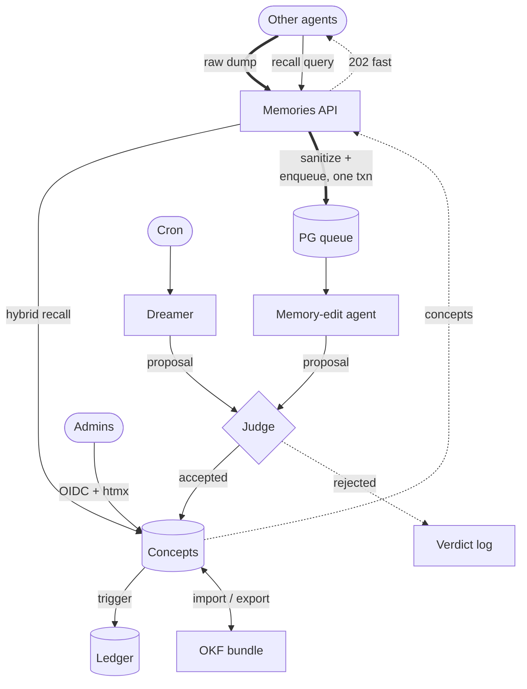

# OKF-in-a-Box — High-Level Design Spec (the WHY)

> **Status:** Draft for alignment. This document captures *design decisions and their
> rationale*. It deliberately avoids critical user journeys (CUJs), endpoint contracts,
> schemas-to-the-column, and test plans — those live in `technical-spec.md`, which is
> written after this document is agreed. Read this to understand *why* the system is
> shaped the way it is; read the technical spec to understand *what to build and how to
> prove it works*.

---

## 1. Thesis — the problem above the problem

The narrow framing is "implement the Open Knowledge Format as a microservice." That is
not the real problem. The real problem is this:

**Autonomous agents generate knowledge at high volume and low trust. Humans need that
knowledge to stay coherent, correct, and portable. Nobody wants to hand-curate it, and
nobody wants to be locked into a vendor's catalog to store it.**

So what we are actually building is a **governed, self-maintaining knowledge base** with
three faces:

1. **A machine read/write hot path** — other agents both *write* memories to us (fire a
   raw dump and get out of the way) and *read* memories back from us (recall relevant
   knowledge to ground their own work). We sit on their critical path, so writes must be
   quick to acknowledge and durable before they are clever, and reads must be fast and
   synchronous. This is a full **Memories API**, not a one-way ingest funnel.
2. **A human oversight plane** — an admin console where people with the right role can see
   what the agents wrote, how it changed over time, and correct the record.
3. **A portability boundary** — the whole corpus imports from and exports to a
   vendor-neutral, plain-markdown format so the knowledge outlives us, our database, and
   our employer.

OKF is the answer to face #3. Postgres, CrewAI, and RBAC are the answers to faces #1 and
#2. Everything below is a facet of *governance*: the judge, the dreamer, the ledger, the
role hierarchy, the review-on-import — these are not separate features, they are the
mechanisms by which low-trust machine output becomes trustworthy institutional memory.

Keep that lens. When a design choice is unclear, the tie-breaker is: *does this make the
knowledge more trustworthy, more durable, or more portable, at acceptable cost on the hot
path?*

---

## 2. What OKF is, and what we are doing differently

The [Open Knowledge Format v0.1](https://github.com/GoogleCloudPlatform/knowledge-catalog/blob/main/okf/SPEC.md)
is deliberately minimal. The entire contract:

- A **bundle** is a directory tree of markdown files.
- Each non-reserved `.md` file is a **concept**. Its **identity is its path** with `.md`
  stripped (`tables/orders.md` → concept `tables/orders`).
- Each concept has a **YAML frontmatter** block. The *only* required field is `type`.
  Recommended-but-optional: `title`, `description`, `resource`, `tags`, `timestamp`.
  Producers may add any keys they like.
- `index.md` (directory listing) and `log.md` (update history) are **reserved filenames**.
- Concepts **cross-link** with ordinary markdown links (bundle-absolute `/…` preferred).
  A link asserts a *relationship*; the type of relationship lives in the surrounding
  prose, not the link. The tree is therefore a **graph**, not a hierarchy.
- Consumers **must be lenient**: never reject a bundle for missing optional fields,
  unknown `type` values, unknown keys, broken links, or missing `index.md`. The format is
  designed to survive being half-generated by agents and refactored underneath you.

That permissiveness is a feature of the *interchange* format. It is a liability as an
*operational* store — you cannot run RBAC, staleness sweeps, provenance, or fast queries
against a pile of lenient markdown. So:

**We are not a filesystem service. We are a Postgres-native microservice that speaks OKF
only at its import/export boundary.** Internally we hold a strict, indexed, relational
model with full history and access control. At the edge we translate: permissive OKF in →
strict internal model (fill defaults, record what was missing); strict internal model out
→ conformant OKF bundle (tarball of the directory tree, `index.md`/`log.md` generated).

This is the central architectural decision and it drives everything else. The filesystem
tree is a *serialization*, not our source of truth. Our source of truth is the database.

---

## 3. System shape

Three planes, one database. Note the **read/write asymmetry** at the Memories API: *writes*
take the slow governed path (durable capture → queue → agent → judge → concepts), while
*reads* go straight from the current-state concepts table and return synchronously — no
queue, no judge, no LLM. The web tier acknowledges writes fast and hands off; the workers
do the slow LLM work off the hot path; the judge is the choke point every *autonomous*
write passes through; Postgres is simultaneously the durability boundary, the job queue,
the version store, and the graph store.

---

## 4. Core design decisions

Each subsection states the decision, the reasoning, and the alternative we rejected.

### 4.1 Postgres is the whole box

**Decision.** One Postgres instance is the durability boundary, the async job queue
(`FOR UPDATE SKIP LOCKED` via [procrastinate](https://procrastinate.readthedocs.io/) or
`pgqueuer`), the version ledger, and the concept graph. No Redis, no RabbitMQ, no separate
search cluster.

**Why.** The service is named *in-a-box* for a reason: it must stand up with one
`docker compose up` into a generic corporate environment. Every additional stateful
service is another thing to deploy, back up, secure, and fail independently. More
concretely, a Postgres-native queue lets the ingest endpoint **write the raw dump and
enqueue its derivation job in a single transaction**. Either both commit or neither does;
there is no dual-write window where we've acknowledged a memory the worker will never see.
That property is worth more than any broker's fancier scheduling. Our SLOs are lax (LLM
latency dominates any agentic hot path we sit on), so we do not need a broker's throughput.

**Rejected.** Redis+Celery (a second stateful service and a dual-write with its own
failure modes); in-process asyncio tasks (lose work on crash, can't scale workers
independently of the web tier).

### 4.2 Two-stage ingestion: raw source of truth, then derived memory

**Decision.** A memory push is a two-stage pipeline with a hard durability line between the
stages.

1. **Capture.** The endpoint receives a raw dump — the calling agent's prompt context, a
   conversation slice, whatever it wants remembered — runs it through the **sanitization
   seam** (§4.15), and writes it **immutable** to a `raw_dumps` table. It enqueues a
   derivation job in the same transaction and returns `202 Accepted` immediately. This is
   all that happens on the hot path. Raw dumps are **retained forever by default** but
   subject to a configurable max-TTL knob for PII-conscious orgs (§4.15).
2. **Derive.** A worker runs the **memory-edit agent**, which reads the raw dump and
   produces a *proposed* OKF concept (a new concept or an edit to an existing one). That
   proposal goes to the judge (§4.3). If accepted, it lands in the `concepts` table.

**Provenance is many-to-one, and re-derivation supersedes-current / appends-ledger.** A
concept is *not* one-dump-one-concept — it accretes: many raw dumps contribute to one
concept over time (a topic sharpened by many contributions), tracked in a first-class
provenance edge table (§4.6). When we re-derive a concept (a better prompt, newer source
material), the "supersede vs. append" question dissolves once you separate the log from the
projection: re-derivation is a normal `UPDATE` to the current-state `concepts` row
(**supersede**) while the ledger trigger writes the prior body to the append-only ledger
(**append**) — you do both. Superseded provenance edges are **soft-invalidated** (marked
with an `invalid_at` + reason), never deleted, so "why did the concept ever say X" survives.
The memory-edit agent is required to **cite which dump(s) justified which claims** (the
Generative Agents "insight (because of …)" move) — the antidote to unexplainable fusion.

**Why.** The raw dump is the source of truth; the wiki concept is a *lossy, opinionated
derivation* of it. Separating them means (a) we acknowledge fast, before any LLM runs, (b)
if the memory-edit agent or its prompt improves later, we can **re-derive** from the
original raw material rather than from an earlier agent's summary of it, and (c) every
concept carries **provenance** — a link back to the exact raw dump(s) it came from, so a
human can always audit "why does the wiki claim this?" down to the verbatim input. This is
the OKF `resource`/cross-link idea turned inward: the concept's ultimate resource is the
raw dump that spawned it.

**Rejected.** Deriving synchronously on the request (puts an LLM on the hot path);
throwing away the raw input after derivation (destroys re-derivation and provenance).

### 4.3 The tiered judge gate

**Decision.** The judge is **two concerns, gated differently by author and risk** — the
Wikipedia autopatrolled / pending-changes model applied to agent memory. All autonomous
writes are *proposals* (the memory-edit agent and dreamer never write directly); human
console edits are direct commits. The ledger trigger (§4.5) records every write regardless.

- **A privacy/PII/secret screen blocks *everyone*** — autonomous agents *and* human editors.
  A leaked credential is catastrophic and author-independent, and it is objectively
  checkable (deterministic-ish, low false-positive, low latency), so blocking humans here
  costs almost nothing.
- **A quality/consistency judge blocks *agents*** but only **advisory-lints *humans*.**
  Agent proposals must pass to commit; human edits by `editor`+ commit immediately, and the
  judge runs async as a *linter* that flags questionable human edits into the review/patrol
  queue (which the dreamer consumes as prioritized work, §4.4). The judge is a *reviewer* of
  human edits, not a *gatekeeper* — which humans accept where they resent being blocked.
- **Blast-radius escalation:** a human *mass* edit, or an edit to a load-bearing core
  concept, escalates from advisory into the blocking quality path — at that scale a human
  edit has agent-like propagation risk.

**Judge rejection handling (reason-routed).** "Rejected" is not one bucket; the reason drives
the response:

- **Always persist the rejection** (concept, verdict, reason class, rationale) even when the
  end state is discard. Reject-rate by reason is dashboarded as the memory-edit-agent
  regression alarm — silent discard would violate "fail fast, not silent."
- **Quality/format rejection → exactly one bounded repair retry**, feeding the judge's
  *specific* structured critique back to the memory-edit agent (a bare "low quality" verdict
  makes retry pure waste). Bound = 1 (2 total judge passes), enforced by a stored
  attempt-count; raised only if the "rescued-on-retry" metric justifies it.
- **Privacy rejection → never a free-form LLM rewrite** (that risks relocating the secret
  into a new field): deterministic redaction + one re-judge, or straight to human review.
- **Escalation sink = an owned human review queue** in the admin console (repair-exhausted or
  privacy-ambiguous cases). This is being built day one, which commits us to a named owner
  role, queue-depth alerting, and a triage SLA — without them a review queue rots into a
  "graveyard."

**Why.** The judge's value is highest exactly where accountability is lowest and volume is
highest — autonomous dumps. Every mature system earned "gate the untrusted, advisory-patrol
the trusted" through real scars: hard-gating trusted humans produces insult, workarounds,
and false-positive friction that drives away your best curators, while buying little (a named
human is already accountable in a way an agent is not). The one place to gate humans hard is
privacy, because a leaked secret is author-independent and objectively checkable. And bounded
*external-feedback* repair works (the judge is the external signal; intrinsic self-correction
degrades outputs — Huang et al. ICLR'24) while unbounded loops are documented token bonfires,
hence the hard bound of 1.

**Prior art.** Wikipedia [Pending Changes](https://en.wikipedia.org/wiki/Wikipedia:Pending_changes)
/ [autopatrolled](https://en.wikipedia.org/wiki/Wikipedia:Patrolled_revisions);
InnerSource [Trusted Committer](https://patterns.innersourcecommons.org/p/trusted-committer);
[Reflexion](https://arxiv.org/pdf/2303.11366) (bounded retry); the AWS SQS
[dead-letter-queue](https://docs.aws.amazon.com/AWSSimpleQueueService/latest/SQSDeveloperGuide/sqs-dead-letter-queues.html)
"graveyard" antipattern (a queue nobody drains).

### 4.4 The dreamer — scheduled self-maintenance

**Decision.** A cron-scheduled **dreamer agent** periodically sweeps the wiki for stale or
incoherent records (driven by the `timestamp` field, provenance age, orphaned links, and
duplication) and emits proposed edits — which go through the same judge gate as everything
else autonomous. The dreamer is also **summonable on demand** to consolidate an
import-conflict diff (§4.7).

**Why.** OKF knowledge rots: the underlying asset changes, the raw dumps pile up,
duplicates accrete. Someone has to garden. Doing it as scheduled proposals through the
existing gate means the maintenance path reuses the trust machinery instead of inventing a
privileged back door. The dreamer is just another proposer.

**Guardrails — three independent kill switches (design assumption: any one guard eventually
fails, so none is load-bearing alone).** No serious consolidation loop runs on a plain
wall-clock timer with unbounded scope; the expensive/dangerous operations are *reading the
whole corpus* (cost) and *writing across it* (corruption), so we bound both plus make the
worst case recoverable. Defaults for a 10⁴–10⁵ corpus, all operator-tunable:

1. **Dirtiness-gated cadence.** Nightly off-peak cron *as an upper bound*, but the run is a
   **no-op unless accumulated staleness/flag/duplicate pressure crosses a threshold** —
   Generative Agents fires reflection on summed-importance, not the clock, so spend tracks
   real work. Bursts of upstream change coalesce/debounce into one batched sweep.
2. **Hard scope cap + per-record cooldown.** Cap **~200 proposed edits per run**
   (deliberately <1% of the corpus, so a bad run is a canary not a catastrophe) and a
   **7-day per-record cooldown** (a recently-edited concept is ineligible — the hard
   guarantee against thrash and the forcing function for convergence). Sampled/ringed, never
   exhaustive.
3. **Gateway cost circuit-breaker.** Hard **per-run and per-day token/dollar budget** at the
   AI gateway (§4.10) that kills a run mid-flight on breach. Two-tier routing: a cheap model
   scans/triages (reading 10⁵ records is the costly part), the expensive model only drafts
   proposals and judges.

Plus two non-negotiables the dreamer shares with the rest of the system: **invalidate-not-
delete** (every edit reversible via the ledger + soft-invalidated provenance, §4.5/§4.6 —
a bad sweep is undoable) and **deterministic freshness** (timestamps/versions decide recency,
*never* the LLM — LLMs resolve the same recency conflict differently across runs). The judge
that gates the dreamer's proposals is a **different model+prompt** than the dreamer, and its
**reject-rate is a canary metric** — a mid-run spike means the proposer prompt has gone bad,
so the run auto-halts. The dreamer also **consumes the human-edit advisory-flag patrol
queue** (§4.3) as prioritized work.

*Prior art:* [Generative Agents](https://arxiv.org/abs/2304.03442) (event-driven reflection),
[mem0](https://mem0.ai/blog/long-term-memory-ai-agents) (bounded per-op blast radius),
[Zep/Graphiti](https://arxiv.org/abs/2501.13956) (invalidate-not-delete),
[LangMem ReflectionExecutor](https://langchain-ai.github.io/langmem/guides/delayed_processing/)
(debounce).

**The dreamer's character depends on raw-source retention (§4.15).** With raw dumps
retained, the dreamer can *re-derive* — reconcile a concept against the original source
material that produced it. When an org sets an aggressive raw-source TTL, that material is
gone, and the dreamer necessarily changes job: it becomes a **research/fact-checking agent**
that can only validate the *current wiki prose* against external sources (e.g. web search),
since it has nothing internal left to re-derive from. This is a real behavioral consequence
of the retention knob, and orgs must tune the dreamer to match their TTL — see the warning
in §4.15.

### 4.5 Versioning — current table plus a trigger-maintained full-text ledger

**Decision.** Two tables per versioned entity:

- `concepts` — **current state only.** Normal CRUD. This is what serves reads fast.
- `concept_ledger` — **append-only, full text of the article at each edit** (not diffs),
  written by **hand-rolled Postgres triggers** on the concepts table, timestamped.

The application interacts only with the current-state table through ordinary CRUD;
Postgres handles the time-travel bookkeeping via triggers. Concurrency is handled by
**Postgres row locking and transactions** — we do not hand-roll locking in the app; the
ledger insert rides inside the same transaction as the CRUD write. Timestamps on the
ledger let the UI **navigate by time**; git-like diffs and history traversal are **computed
on read** from adjacent full-text snapshots. `log.md` on export is generated from the
ledger.

**Why.** Full-text snapshots (vs. diffs) make time-travel and re-rendering trivial — any
past version is a single row, no diff-chain replay, no corruption cascade if one diff is
wrong. Triggers keep the history-keeping *out of the application code*, so there is exactly
one way to mutate a concept (CRUD on the main table) and history can never be forgotten by
a code path that skipped the bookkeeping. Leaning on Postgres transactions for concurrency
is the boring, correct answer: the ledger row and the concept row commit together or not at
all. Storage cost is real but cheap; markdown is small and this is knowledge we explicitly
want to keep forever.

**Rejected.** Diff-based history (replay cost, fragility); app-code-maintained history
(easy to bypass); Dolt as the concept store (couples the app DB to a second engine and
undercuts the Postgres-native story — Dolt stays where it already is, for beads issue
tracking).

### 4.6 The OKF ↔ relational mapping

**Decision.** The internal model, sketched (columns are illustrative; the technical spec
nails them down):

- `raw_dumps` — immutable source-of-truth inputs. `(id, payload, producer_principal, received_at, …)`
- `concepts` — current state. `(concept_path PK, type, title, description, resource, tags[], okf_timestamp, body_md, frontmatter_extra JSONB, …)`. The recommended OKF fields get real typed columns (they're queryable); everything else a producer sends lives in `frontmatter_extra` JSONB so we honor OKF's "any additional keys" rule losslessly.
- `concept_ledger` — append-only full-text history (§4.5).
- `concept_links` — the graph edge table, parsed out of body markdown links. Lets us answer "what links here / what is orphaned / what did the dreamer break" as SQL.
- `concept_provenance` — the many-to-one source edges: `(concept_path, raw_dump_id, contribution_role, valid_at, invalid_at, reason)`. Dump references *accrete* (§4.2); superseded ones are soft-invalidated (`invalid_at` + reason), never deleted — the Wikidata "one claim, many references, deprecate-not-delete" shape. This is what lets a human trace any claim to the verbatim dump(s) that justified it.
- `edit_proposals` + `judge_verdicts` — the audit trail of the gate (§4.3): what was proposed, by which agent, from which raw dump, what the judge decided and why.
- RBAC tables — `principals` (human and service), `roles`, `api_keys` (§4.8, §4.9).
- import staging tables (§4.7).

**Why.** Concept identity = path matches OKF exactly, so import/export is a near-identity
mapping and round-tripping is cheap. Typed columns for the five recommended fields give us
fast filtered queries and a clean admin UI; JSONB for the rest means we never lose a
producer's custom keys and never reject a bundle for having them (OKF leniency, honored).
The `concept_links` table turns OKF's implicit graph into something we can actually query
and garden.

### 4.7 Import / export — the portability boundary

**Decision.**

- **Export** is always available: serialize the current concepts to an OKF directory tree,
  generate `index.md` per directory and `log.md` from the ledger, tar it up. Fully
  conformant, vendor-neutral, re-importable anywhere.
- **Import is an owner/admin-only event** — deliberately heavyweight, not something an
  editor triggers casually. We parse the incoming bundle *leniently* (per OKF), then merge
  against existing concepts by path identity.
- **On collision** (incoming concept path == existing concept path), we present a
  **git-style diff review** in the console. The admin resolves like a merge/rebase:
  accept incoming, keep local, or hand-merge. Additionally, a **"summon the dreamer"
  button** hands the diffed view to the dreamer agent to propose a consolidated merge,
  which the admin then reviews.
- **Reserved files (`index.md` / `log.md`): regenerate on export, ignore on import.** On
  export we emit a full per-directory `index.md` (a free projection of concept frontmatter —
  matching what all three reference bundles do) and a `log.md` generated from our ledger.
  The `log.md` is where we're *differentiated*: the reference repo ships **zero** log.md
  files because almost no producer can emit an honest change history — but our append-only
  ledger *is* exactly that, folded to ISO-8601 date headings (the one `MUST` in OKF §7),
  newest-first, with `**Creation**`/`**Update**`/`**Deprecation**` prefixes. On import we
  **ignore** producer-authored `index.md`/`log.md` for building state and regenerate our own:
  `index.md` is 100% derivable (ingesting it invites drift), and `log.md` is unstructured
  prose with no reliable schema (OKF §7: "Log entries are prose"), so structured ingestion is
  unreliable by construction. Per OKF §9 a consumer must not reject on missing/odd reserved
  files anyway. *(Deferred follow-up: an imported `log.md` is the only carrier of pre-custody
  history — if that ever matters, store it verbatim as an opaque provenance artifact keyed to
  its directory, never parsed into our authoritative ledger.)*

**Why.** Import mutates the whole corpus and can silently clobber curated local knowledge
with stale or foreign data — that is an owner/admin blast radius, not an editor one.
Git-style review is the mental model engineers already have for "two versions of the same
thing disagree," and it keeps a human in the loop for the one operation where automated
last-write-wins is genuinely dangerous. The dreamer-assist gives the leverage of automation
(consolidate 200 conflicts) without removing the human's final say. Note this is a
*different* path from the judge gate: imports are human-driven-with-agent-assist, whereas
routine agent memories are agent-driven-with-human-oversight. Both keep a human on the
dangerous side of the line.

**Rejected.** Fully automated timestamp last-write-wins (clobbers curated knowledge
silently); forcing every import conflict through the LLM judge with no human diff view
(removes the human from a high-blast-radius operation).

### 4.8 RBAC and the human IDP

**Decision.** Four roles, strictly ordered: **owner → admin → editor → reader.** Owners
are **bootstrapped from environment variables at deploy time** (so a fresh box has a way
in without a chicken-and-egg IDP problem); every other role is managed in the database
through the admin console. Human authentication is **OIDC**, and we ship with **Keycloak**
as the default, self-hosted IDP so the box is complete out of the gate — but we build to
the OIDC standard so any org can **swap in their own IdP** (Okta, Entra, Auth0, Ping) by
configuration, not code.

**Why.** Owner-by-env solves bootstrap cleanly and keeps the ultimate authority outside the
database's own access-controlled surface (you can't lock yourself out by editing a row).
Keycloak-as-default honors the in-a-box thesis; OIDC-not-Keycloak-specific honors the
"generic corporate deployment" requirement — nobody adopts a service that forces its own
identity provider on them. This is the craftsman move: build to the open standard, ship a
working default, don't marry the default.

### 4.9 Agent-to-service authentication

**Decision.** **Both, pluggable, with API keys as the default-on path.**

- **API keys** (hashed at rest, issued and revoked in the admin console, each mapped to a
  service principal and RBAC role) are the out-of-the-box default. A calling agent sends
  `Authorization: Bearer okf_sk_…` and it works the moment the container is up — *no
  Keycloak configuration required*.
- **OIDC client-credentials** (each agent gets a Keycloak service-account client, uses the
  `client_credentials` grant) is opt-in, for orgs that want machine identity unified under
  their existing IdP.

Both extractors resolve to the **same internal abstraction**: a `service-principal → RBAC
role`. The auth middleware simply tries both token formats and feeds one resolver.

**Why (and the norm question, answered).** Product APIs that expect external callers —
Stripe, OpenAI, Anthropic, GitHub PATs, SendGrid — near-universally use **API keys**;
they're what an integrating developer reaches for, with no refresh dance on the hot path,
trivial revocation, and per-key scoping. Enterprises that have *already* standardized
machine identity on an IdP use **OIDC client-credentials / service accounts** (Keycloak
service clients, GCP service accounts, AWS IAM roles, SPIFFE/mTLS at the heavy end) for one
identity plane and central revocation. Real orgs do both; which is "correct" depends
entirely on whether the deployment already runs an IdP for *machines*. Pluggable is
therefore the honest answer and it's cheap — the cost is one extra token extractor, because
both paths converge on the same principal-resolution logic. API keys are default-on
specifically so the out-of-the-box experience doesn't require standing up IdP machine
identity first; that's the whole in-a-box thesis applied to auth.

### 4.10 Model configuration — per-agent, against the org's AI gateway

**Terminology first — there is no chat model here.** Nothing in this service is a human
conversing with an LLM. Our agents (memory-edit, judge, dreamer) are **non-interactive**:
they run from the queue or from cron and do instruction-following *generation*. The only
"chat"-shaped thing is the API transport (the OpenAI chat-completions endpoint), not the
product category. Two kinds of model are in play — a **generation model** the agents call,
and an **embedding model** for hybrid retrieval (§4.14) — and neither is interactive.

**Production decision.** Each agent and the embedding model are **independently
configurable**, and the org connects CrewAI to **their own AI gateway** in the standard
litellm/CrewAI way (base URL + credentials + a model name per agent). We do **not** build a
bespoke provider layer or ship opinions about which vendor to use — we expose the standard
CrewAI `LLM` configuration surface and let the org point each agent at their gateway. So:

- The **memory-edit agent**, the **judge**, and the **dreamer** each get their own model
  setting. They have genuinely different cost/quality profiles — high-volume derivation
  wants something cheap and fast; the judge may warrant a stronger reasoner — and per-agent
  config lets the org spend accordingly.
- The **embedding model** is likewise a config setting pointed at the gateway (or wherever
  the org serves embeddings).
- The org's gateway (litellm proxy, Portkey, Cloudflare/Kong AI Gateway, a cloud provider's
  gateway, whatever they run) owns provider routing, API keys, rate limits, cost controls,
  fallback, and observability.

**Why.** Model choice, spend, data-handling, and provider routing are org decisions that
change per-deployment and over time, and the AI-gateway pattern is exactly where
organizations already centralize them. Reinventing that plane inside this service would be
brain-rot — we'd be building a worse version of the thing they already run. Per-agent
assignment matters because the judge and the memory-edit agent are not interchangeable
workloads. Our job is to expose clean, standard configuration, not to have opinions about
the org's model strategy.

**Local development (escape hatches — instructions, not architecture).** So a developer can
run and test the app *without* wiring up the org's gateway or spending on frontier APIs, we
document three purely-local paths. None of these is the production design; they exist so the
app is playable on a laptop.

1. **A local OpenAI-compatible server** (Ollama / llama.cpp / vLLM / MLX-LM on Mac), for a
   dev with a decent GPU or an M-series Mac. Dev-baseline models that run acceptably on such
   hardware and still do the **function-calling + structured output** the agents need:
   generation — **Qwen3.5-9B-class @ Q4** (~7GB) or **Gemma 4 E4B**; embedding — **BGE-M3**,
   or **nomic-embed-text** (137M, CPU-only) when there's no GPU at all.
2. **`claude -p`** (headless Claude Code) and 3. **`copilot -p`** (Copilot CLI programmatic
   mode), for devs who lack the silicon and would rather drive the agents with a
   subscription they already pay for.

Setup instructions for these on **Linux and macOS** are a first-class doc deliverable.

> **Hazard — never point the dev escape hatches at real data.** The hosted CLIs *retain the
> prompts you send them* (GitHub retains Copilot CLI prompts per its terms; Anthropic's
> terms govern `claude`). They are for playing with the app on throwaway data only. Real org
> memory runs through the org's chosen gateway under the org's own data-handling terms
> (§4.15). *(ToS note, checked July 2026 and volatile: shelling the real `claude -p` binary
> is currently compliant because it is Claude Code itself — the Feb 2026 ToS restricts the
> OAuth token in third-party tools, not invoking the CLI — but Anthropic changed this policy
> three times in six months, which is exactly why it stays a dev convenience.)*

### 4.11 Web stack — Litestar + htmx, server-rendered

**Decision.** [Litestar](https://litestar.dev/) (async ASGI, formerly Starlite) serves both
the machine JSON API (with generated OpenAPI for the agent-facing endpoints) and the human
admin console, which is **server-rendered HTML with htmx** for interactivity — diff views,
review queues, history navigation — with **no SPA**.

**Why.** htmx server-rendering keeps the console a thin, legible layer over the same
backend the agents hit, with no separate frontend build, no client-side state store, no API
duplication for the sake of a JavaScript framework. The console is fundamentally CRUD +
diff-review + queues — exactly what hypermedia does well. This is the anti-brain-rot choice:
the complexity stays in the domain, not in a client bundle.

### 4.12 The read/write asymmetry, restated

The Memories API has two hot-path shapes and they are optimized differently.

**Writes are async.** Ingest endpoints do the minimum: validate auth, write the raw dump,
enqueue the derivation job, return `202`. Everything expensive — the memory-edit agent, the
judge, the dreamer's sweeps — runs in worker processes pulling from the Postgres queue.
Workers scale independently of the web tier.

**Reads are synchronous.** Recall endpoints serve directly from the current-state
`concepts` table (and its indexes) — no queue, no judge, no LLM in the loop. A calling agent
asking "what do we know about X" gets an answer in one round trip. Reads never mutate and
never propose, so they skip the entire governance path. This is why the concepts table is
tuned for fast filtered/lookup/search reads while the raw dumps and ledger are tuned for
durable append.

Because our SLOs are dominated by LLM latency in the callers' own pipelines, we optimize the
*write-acknowledgement* path and the *read* path hard, and let the *derivation* path take
the time it needs.

### 4.13 Scale — targets and topology

**Decision.** Target **org-wide scale on a single Postgres primary plus read replicas**,
sized against a ~1,000-engineer org as the reference deployment. No sharding, no separate
search or vector cluster.

**Why — do the math, and notice which axis is hard.** There are two scaling axes and only
one bites.

*Event throughput is trivial.* Every developer's Copilot plus bespoke agentic systems
writing on task boundaries is order 50k saves/day ≈ 0.6/s average, ~6/s peak in one
timezone. Recall fires more often — order 10⁵–10⁶ reads/day ≈ 12/s average, ~120/s peak.
Postgres serves thousands of indexed reads/s on one node without noticing; writes barely
register and the queue absorbs bursts. The genuinely expensive resource is **LLM derivation
throughput**, not the database — ~6 sustained / ~60 peak concurrent derivations, which is a
worker-fleet and token-budget question answered by scaling workers, not the DB.

*Corpus size is the real axis — and it stays small because the judge dedups.* This is the
load-bearing insight: the `concepts` table is a **curated wiki, not a log**. The memory-edit
agent + judge exist to *consolidate* — merge into existing concepts, reject duplicates — so
the distinct-knowledge count is sublinear in write volume and plateaus. An org's actual body
of reusable knowledge is realistically **10⁴–10⁵ concepts** (Wikipedia is ~7M for *all human
knowledge*). The `raw_dumps` firehose does grow unboundedly (10⁶–10⁸ rows over time), but
**nobody runs recall against raw dumps** — partition them by time and archive cold ones to
object storage. So the number governing recall is 10⁴–10⁵, which never stresses Postgres.

*Topology falls out naturally.* Writes hit the primary (governed, serialized through the
judge); **reads fan out to read replicas** because they never mutate. That is the path from
~120/s to thousands/s of recall without leaving Postgres.

**Rejected.** Sharding or a dedicated search/vector cluster (unjustified at a curated-wiki
corpus size; violates in-a-box); treating the concepts table as an append log (would balloon
it into the millions and defeat both recall quality and the whole point of the judge).

### 4.14 Retrieval — hybrid lexical + semantic, inside Postgres

**Decision.** **Hybrid retrieval from day one:** Postgres FTS (`tsvector` + GIN) for
lexical/exact matches, `pgvector` (HNSW) for semantic matches, fused with **Reciprocal Rank
Fusion**. Embeddings are computed over the **distilled concept** (not the raw dump) on write,
during the derivation we already run. Everything stays in Postgres.

**Why — FTS breaks on *meaning*, not scale.** At 10⁴–10⁵ concepts, FTS is fast essentially
forever (people run PG FTS on 10M+ docs). Where it fails for *agent recall* is **lexical
mismatch**: "how do I roll back a deploy" returns nothing against a concept titled "reverting
a release" — no shared keywords — and the agent then re-derives knowledge the org already
holds. That is the *primary* recall failure mode, and it is a quality problem, not a
performance one. FTS is exactly right for the cases vectors are weak at (error codes,
identifiers, function names — literal tokens), so we keep both and fuse. `pgvector` HNSW at
our corpus size is sub-millisecond and RAM-resident (100k × 1536-dim × 4B ≈ 600MB, less with
`halfvec`); it comfortably handles 1–10M vectors on one node, well beyond where we land.

Starting FTS-only and "adding vectors later" is the seductive-but-wrong minimal move:
recall-without-semantics is building the wrong thing, and retrofitting means a corpus-wide
embedding backfill plus a query-path rewrite. The day-one cost is small — one embedding call
on write (we're already doing an LLM pass there), one vector column, one HNSW index. The one
real ongoing cost is a re-embed migration on embedding-model change, which at 10⁵ docs is a
batch job, not a crisis.

**Rejected.** FTS-only (fails on paraphrase — the dominant agent-recall case); a dedicated
vector database (unneeded below millions of vectors; breaks in-a-box); embedding raw dumps
(embed the curated concept, which is what recall returns).

### 4.15 Distillation, sanitization, and the PII knobs

This is where situated, sensitive input becomes generic, safe, org-collective knowledge.
Sensible defaults out of the box; knobs an org twists when it must.

**Distillation (in the memory-edit agent).** The agent's charter is to extract the
**reusable, org-general lesson and drop the incidental** — anonymize actors, generalize the
specific instance to the pattern, rewrite "the bug in `/Users/nathan/orders.py`" into "the
orders service fails when…". This is what makes the corpus genuinely useful as
human-readable internal documentation, not a pile of situated session transcripts.

**The sanitization seam (a Litestar controller decorator).** A pluggable
sanitize/validate step runs on the write controller *before* the raw dump is persisted. We
**ship an XSS input sanitizer by default** — necessary regardless, because we render
agent-generated *and* imported markdown into HTML in the console, so an unsanitized memory
containing `<script>` is a stored-XSS vector the moment a human views the wiki. That shipped
sanitizer is also the **worked example an org clones to drop in its own PII/secret-scrubbing
validator at the same seam** — same decorator pattern, same insertion point, no core change.
Defense in depth: we *also* allowlist-sanitize at markdown→HTML **render** time (nh3/ammonia
-style), because markdown can embed raw HTML — input sanitization and safe rendering are two
layers, not one.

**Retention (a single config knob).** Postgres stores data at rest cheaply, so retention is a
**PII concern, not a storage one**. Raw dumps are **retained forever by default**; an org
sets a **max-TTL** on all raw sources via config and a scheduled purge sweep (reusing the
queue/cron infra) enforces it. Default = no expiry.

> **Warning — a short TTL changes what your dreamer *is*.** Purging raw sources destroys the
> ability to re-derive a concept from its original material (§4.2), and it re-tasks the
> dreamer (§4.4). An org that kills every raw source in, say, one week no longer has a
> dreamer that reconciles concepts against their sources — it has a **research agent** that
> can only confirm the current wiki prose against *external* sources like web search,
> because nothing internal survives to re-derive from. That may be perfectly acceptable, but
> it is a deliberate posture: **if you set an aggressive TTL, you must tune the dreamer to
> match it.** Do not set a short TTL and expect source-grounded re-derivation to keep
> working — the two are mutually exclusive.

**v1 keeps this simple; a three-tier retention model is the v2 target.** For v1 the above is
the whole story: raw dumps forever-by-default with a max-TTL knob, and short-TTL deployments
simply forfeit re-derivation. The reason we don't try to be cleverer *yet* is a legal reframe
worth stating so v2 is shaped correctly: under GDPR there is no "scrub it and keep it forever"
option. A snapshot detailed enough to re-derive a good concept is, by construction, still
**pseudonymised personal data** (residual quasi-identifiers + sub-100% detection recall
guarantee it — Recital 26; WP29 05/2014), so it carries the *same* storage-limitation and
erasure obligations as the raw dump — scrubbing *moves* the liability, it doesn't delete it.
Scrubbing hard enough to reach true *anonymisation* strips the detail re-derivation needs, and
usually can't even be certified. So the correct v2 answer is **three tiers, three clocks,
nothing mislabelled**: (1) raw dump — short TTL, **purge = crypto-erasure** (destroy a
per-record key rather than chase every backup replica; once the key is gone the ciphertext
trends non-personal); (2) a **pseudonymised derivation-input snapshot** on its own *medium*
TTL, explicitly treated as personal data and wired into the same erasure path (built with
consistent pseudonymisation, e.g. Presidio's `InstanceCounterAnonymizer`, and *no* mapping
vault by default — it's a re-identification bomb); (3) the durable concept. Setting
snapshot-TTL=0 degrades cleanly to "forfeit re-derivation." This is deferred to v2 because it
is real engineering (per-record key management, a second TTL clock, erasure fan-out), and the
v1 forfeit-or-keep-forever posture is honest in the meantime. *(Verify EDPB 01/2025
pseudonymisation guidelines' final-adoption status and the CJEU* EDPS v SRB *C-413/23 P
operative paragraphs before the crypto-shred legal argument goes load-bearing.)*

**Access asymmetry.** Concepts are org-readable; **raw dumps are not** — they hold the
sensitive originals. Provenance stays auditable by owner/admin, but the recall API never
exposes raw dumps, and raw dumps are candidates for encryption at rest.

**The judge as a secondary privacy check.** Since every autonomous write already passes the
judge (§4.3), the judge can additionally reject a proposed concept that still carries
PII/secrets — a cheap second layer at an existing choke point.

**Why.** PII policy is org- and legal-regime-specific; a general-purpose OSS deployable
cannot know a deployer's obligations, so we ship the **mechanism** (decorator seam + TTL knob
+ access asymmetry), not a baked-in policy. Folding the PII hook into the XSS sanitizer we
need anyway means one seam does double duty and the reference implementation is already in
the box.

**Rejected.** A heavyweight built-in PII engine as core (wrong default for most, and no
engine fits every legal regime); scrubbing only via the LLM (never trust a model as a
security boundary — the deterministic seam is the safety net).

### 4.16 Namespacing, and the sensitive-deployment pattern

**Decision.** **One global flat namespace, scoped only by tags.** Recall can filter by tag;
that is the entire namespacing mechanism. We do **not** build per-team RBAC regions. For
sensitive knowledge, the pattern is: **run a separate, dedicated instance of this service**
under the owning team's control, and program that team's agents to recognize sensitive
content and route those memories to their sensitive deployment.

**Why.** A single shared namespace *is* the point — collective memory only compounds if it
pools. Tags give humans navigability and agents scoped recall without a policy engine. And
every org's sensitive-data RBAC is **novel every time**, so a configurable multi-tenant
isolation layer in core is exactly the enterprise complexity that fits no one — the classic
brain-rot we refuse. The unix answer instead: **one instance = one trust domain; scale
privacy by deploying another box, not by growing a policy engine.** Composing dedicated
instances is simpler to reason about, simpler to secure, and pushes the bespoke part to the
only people who can get it right — the deploying team.

**Rejected.** Configurable per-team RBAC regions / row-level multi-tenancy in core (bespoke
for every org, unbounded policy surface, security footguns); a hierarchical namespace (tags
are a richer, flatter graph — consistent with OKF's own link-graph model).

### 4.17 Priming — the hot core

**Decision.** A **third read access pattern**, distinct from recall (§4.14) and index
navigation (§4.7): a small, **size-bounded, tag-scoped set of always-load concepts**, marked
`core` on the same `concepts` table, served by a cheap synchronous **`prime` endpoint**. A
calling agent fetches it once at startup and pins it in its context. It is **maintained by
the dreamer** (kept small, fresh, high-signal) under a hard size budget, and seeded by humans.

**Why — the core is what makes retrieval possible at all.** Recall answers *"I have a
question"*; the index answers *"what is the shape of what exists."* But an agent starting cold
has neither a question nor a reason to form one — it does not know the wiki *contains*
anything worth asking about. Retrieval is then chicken-and-egg: you only find what you already
knew to look for. **The hot core breaks that loop** — it orients the agent to what the org
knows, what conventions bind it, and, crucially, *that more memory exists and how to ask for
it*. It is also the right home for foundational knowledge too load-bearing to depend on
retrieval luck — invariants, conventions, "never do X" — the material that must be present
*regardless* of query, and which lexical/semantic mismatch (§4.14) would otherwise silently
drop. Priming is the answer to "what does an agent load when it has no query yet."

**Mechanism.**
- **A `core` marker on the `concepts` table** (a frontmatter flag / reserved tag) — *no new
  storage tier*. Postgres is still the whole box; the hot core is a flagged selection over the
  concepts we already have, not a separate store or cache.
- **`prime(tags=[…])`** — a cheap synchronous read returning the hot-core concepts, optionally
  scoped. The caller pins the result. It is **advisory**: we do not own the caller's context
  window, so what actually stays resident is their choice (§5). We curate and serve; they pin.
- **Tag-scoped (§4.16).** A *single* global core is too coarse at org scale — a payments
  copilot and a frontend copilot need different always-know sets — so the core is a small
  global core plus per-domain cores selected by tag.
- **Hard size budget — boundedness *is* what makes it hot.** A core that grows unbounded stops
  being a core (MemGPT's core-memory blocks are fixed-size for exactly this reason). The
  dreamer enforces the budget with the same gardening machinery and edit cap as §4.4:
  prune/merge/demote to keep the core small and high-signal. Demotion is not deletion — a
  concept dropped from the core still lives in the corpus, reachable by recall.

**Why advisory + server-side curation.** We are a memory *service*, not the agent runtime, so
what lives in the caller's context is the caller's call; and the curation intelligence (what
*deserves* to be core) stays on our side, mirroring the server-side-distillation split of §5.

**Rejected.** Making the index the primer (too large to load at org scale, and it is a *map*,
not *content* — §4.7); a single global core (too coarse — domains differ); a separate
hot-storage or in-memory cache tier (unneeded — the concepts table is RAM-resident at our
scale and reads fan out to replicas, §4.13; the hot core is a *semantic* always-load layer,
not a performance optimization); an unbounded core (stops being hot). *Prior art:*
MemGPT/Letta **core memory** (fixed-size, always-in-context blocks vs. retrieved archival
memory); the llm-wiki root/README-you-always-read.

---

## 5. The caller contract — how agentic systems talk to us

A calling system (typically a CrewAI crew, but the contract is framework-agnostic) uses us
in two directions, the way a human uses an llm-wiki.

**Writing ("remember this").** Before or as a crew completes a unit of work, it POSTs its
**prompt context / relevant conversation slice** to our write endpoint as a raw dump,
authenticated by API key. It gets an immediate `202`; it does **not** wait for a wiki
concept to be produced. We handle derivation and judging asynchronously. The caller's job
here is trivial and non-blocking — dump raw material, move on. All the intelligence is on
our side of the boundary.

**Reading has two moments — prime at startup, recall per-query.** *At startup* a crew calls
**`prime`** (§4.17) to pin the small, tag-scoped hot core in its context — the orientation
that tells it what the org knows and that more memory exists to ask for. *Then, during its
work*, it queries **`recall`** to pull query-relevant memories — by concept path, by type/tag,
or by hybrid search — grounding its reasoning on what the wiki already holds. Both are
synchronous and fast (§4.12); the caller gets concepts back in the response. The read side is
what makes us a *memory*, not just an audit sink: agents that write to us later read from us
(or each other's contributions) to avoid re-deriving what the swarm already learned — and
without the prime step they might never know to look.

**We ship four integration surfaces day one**, each assigned to what it is actually good at.
Distillation always stays **server-side** (mirroring mem0's `infer=True`): callers ship raw
verbatim context, we extract — which keeps the client dumb and the "source of truth"
genuinely verbatim.

1. **A documented, stable HTTP contract** (`/recall`, `/save`) — the bedrock, so we're never
   a bottleneck and any language can integrate.
2. **A thin client library** (Python first) over that contract — retries, auth, batching. How
   every peer (mem0/Zep/LangMem) actually distributes.
3. **A bundled CrewAI auto-capture SAVE helper**, hooked to the event bus's
   **`LLMCallCompletedEvent` / `TaskCompletedEvent`** — one-liner `OKFMemory(...).attach(crew)`.
4. **An MCP server for RECALL** — universal agent-invoked read across any MCP client.

**Interop guidance — a plain `@tool` is not enough for save; and MCP structurally can't do
verbatim save.** The two directions want *different* seams, and this is a point our docs must
make loudly:

- **Recall is a tool** (or an MCP tool). Agent-invoked read, exactly what tools/MCP are for.
- **Save is a lifecycle callback, not a tool.** If saving is a tool the agent "decides" to
  call, two failure modes bite: the agent forgets, and when it does call it, it passes a
  *self-authored summary* — defeating the raw-source-of-truth premise (§4.2). The correct
  seam is a **framework lifecycle callback**. Critically, in CrewAI that means the **event
  bus** (`LLMCallCompletedEvent`, whose `messages` field carries the *verbatim* prompt +
  system instructions + accumulated context) — **not** the `task_callback` constructor arg or
  `after_kickoff`, which hand you only the *distilled* `TaskOutput`/`CrewOutput`. Save over
  MCP is structurally impossible to do verbatim (the host decides when tools fire → the agent
  can forget; tool inputs are model-authored → you get a self-summary; the server never sees
  the system prompt), so MCP-save is offered at most as a documented, lossy manual escape
  hatch for non-CrewAI callers.

**Biggest risk to flag:** CrewAI's event API is young and churns (there's a known
`LLMCallStartedEvent.messages` multimodal validation bug), so the auto-capture helper needs
**version pinning + a CI test against each CrewAI release**, or it silently stops capturing —
treat the `messages` schema as an explicit version boundary.

---

## 6. Deployment — the "in-a-box" promise

One `docker compose up` brings up: Postgres, Keycloak (default IdP), the Litestar app, the
worker(s), and optionally a local LLM server. Owners are set via environment variables.
Swapping the IdP is configuration (OIDC issuer URL + client). Models are configuration too:
the org points CrewAI at **their own AI gateway** and assigns a model per agent (§4.10) — we
ship no model opinions for production. A generic corporate deployment should be able to adopt
the service without reading our source — point it at their IdP, point it at their AI gateway,
set the owners, go. (Local model servers and the `claude -p`/`copilot -p` hatches are
dev-only conveniences, not part of a production deployment.)

**Read replicas for scale.** The primary handles governed writes; recall traffic fans out to
Postgres read replicas (§4.13). This is the horizontal scaling knob for an org-wide
deployment and it requires no application change beyond routing reads to a replica pool.

**The sensitive-deployment pattern (documented, first-class).** This service is a **single
trust domain** by design (§4.16). Sensitive or regulated knowledge does *not* get segregated
by in-app RBAC regions — instead, run a **separate, dedicated instance** of the service under
the owning team's control, with its own database, its own access rules, and (typically) its
own PII scrubber wired into the sanitization seam and a tight max-TTL on raw dumps. The
team's agents are programmed to recognize sensitive content and route those memories to their
sensitive deployment rather than the org-wide one. You scale privacy by deploying another
box, not by growing a policy engine.

---

## 7. Non-goals / explicitly deferred

- **Not a filesystem-native OKF tool.** We speak OKF only at import/export; the DB is
  truth. (§2)
- **Not a general search platform.** Retrieval is hybrid FTS + `pgvector`, all inside
  Postgres (§4.14); no Elasticsearch, no dedicated vector cluster.
- **Not multi-tenant.** One instance = one trust domain (§4.16). Sensitive knowledge gets a
  separate deployment, not an in-app isolation layer. Scoping within an instance is tags
  only.
- **No baked-in PII policy.** We ship the mechanism — sanitization seam + max-TTL knob +
  access asymmetry (§4.15) — not a policy. Default is XSS-safe, forever-retention, no PII
  redaction. The three-tier crypto-shred + pseudonymised-snapshot retention model is a **v2
  target**, not v1 (§4.15); v1 short-TTL deployments forfeit re-derivation.
- **No custom locking / eventual-consistency machinery** — Postgres transactions are the
  concurrency model. (§4.5)
- **No production model opinions.** Production model choice is the org's, configured
  per-agent against their AI gateway (§4.10). Local model servers and the `claude -p` /
  `copilot -p` hatches are **dev-only**; the CLI wrappers may be a fast-follow given their
  custom-wrapper cost.

---

## 8. Open questions

The original eight are **resolved** — decisions folded into the sections above; the research
that informed them is in [`open-questions-findings.md`](./open-questions-findings.md).

1. ~~Judge scope~~ **RESOLVED (§4.3):** tiered gate — universal privacy screen blocks
   everyone; quality judge blocks agents, advisory-lints humans; blast-radius escalation.
2. ~~Provenance cardinality~~ **RESOLVED (§4.2/§4.6):** many-dumps→one-concept via a
   provenance edge table; re-derivation supersedes-current/appends-ledger; soft-invalidate;
   mandatory citation.
3. ~~Judge rejection handling~~ **RESOLVED (§4.3):** reason-routed — log always; one bounded
   repair retry (quality only); deterministic-or-human for privacy; owned review queue built
   day one.
4. ~~Dreamer cadence & scope~~ **RESOLVED (§4.4):** dirtiness-gated cadence, ~200 edits/run,
   7-day cooldown, gateway cost breaker, invalidate-not-delete, deterministic freshness.
5. ~~`index.md`/`log.md` fidelity~~ **RESOLVED (§4.7):** regenerate both on export (ledger-
   derived `log.md` is our differentiator), ignore both on import.
6. ~~Local model floor~~ **RESOLVED (§4.10):** production is per-agent config against the
   org's AI gateway; the Qwen/Gemma/BGE-M3/nomic figures are local-dev baselines only.
7. ~~PII snapshot under TTL~~ **RESOLVED (§4.15):** v1 = raw forever/TTL-knob, short-TTL
   forfeits re-derivation; three-tier crypto-shred + pseudonymised snapshot is the v2 target
   (a useful scrubbed snapshot is still personal data, so it can't be "kept forever").
8. ~~Integration surface~~ **RESOLVED (§5):** four surfaces day one — HTTP contract, thin
   client, CrewAI event-bus SAVE helper, MCP recall.

**Residual follow-ups carried into the technical spec (smaller, mechanical):**

- Pin dev-baseline model + embedding-model versions once the memory-edit/judge prompts are
  tested against them (§4.10).
- CrewAI event-bus API is young/churning — version-pin + CI test the auto-capture helper
  against each release; model the `messages` schema as an explicit version boundary (§5).
- Deferred: store an imported `log.md` verbatim as an opaque per-directory provenance artifact
  *if* pre-custody history ever matters (§4.7).
- Before the v2 crypto-shred/pseudonymisation work goes load-bearing, re-read the primary
  legal sources (EDPB 01/2025 pseudonymisation guidelines final-adoption status; CJEU
  *EDPS v SRB* C-413/23 P operative paragraphs) (§4.15).
- Define the review-queue owner role, queue-depth alerting, and triage SLA that the day-one
  review queue commits us to (§4.3).
- Hot core (§4.17): set the default size budget, and decide the seeding story for a
  cold-start wiki (an empty corpus has no core — who/what establishes the initial global +
  per-domain cores, and how `core` promotion/demotion is decided by humans vs. the dreamer).

---

## 9. Glossary

- **Concept** — one OKF markdown document; a single unit of wiki knowledge. Identity = path.
- **Bundle** — an OKF directory tree; our import/export unit (a tarball).
- **Raw dump** — the verbatim, immutable input an agent sends us; the source of truth from
  which concepts are derived.
- **Memory-edit agent** — the worker agent that turns a raw dump into a proposed concept.
- **Judge** — the LLM-as-judge: a universal privacy screen (blocks everyone) plus a quality
  gate that blocks agents and advisory-lints humans (§4.3).
- **Review/patrol queue** — the owned admin-console queue where repair-exhausted or
  privacy-ambiguous rejections, and advisory-flagged human edits, land for human triage; also
  fed to the dreamer as prioritized work.
- **Provenance edge** — a soft-invalidatable link from a concept to a raw dump that
  contributed to it; accretes many-to-one and records the "why" behind a claim (§4.6).
- **Dreamer** — the scheduled maintenance agent that proposes edits to keep the wiki fresh
  and coherent, and assists import-conflict consolidation.
- **Ledger** — the append-only, full-text, trigger-maintained version history of concepts.
- **Principal** — an authenticated actor: a human (via OIDC) or a service (via API key or
  OIDC client-credentials), each bound to an RBAC role.
- **Distillation** — the memory-edit agent's job of turning a situated, sensitive raw dump
  into a generic, reusable, de-identified concept fit for org-collective memory.
- **Sanitization seam** — the pluggable validate/scrub step (a Litestar controller
  decorator) on the write path; ships an XSS sanitizer by default and is the documented
  insertion point for an org's PII/secret scrubber.
- **Hybrid retrieval** — recall combining Postgres FTS (lexical) and `pgvector` (semantic),
  fused with Reciprocal Rank Fusion; all inside Postgres.
- **Hot core** — a small, size-bounded, tag-scoped set of always-load concepts (marked `core`
  on the concepts table) that a caller pins at startup; the priming layer (§4.17).
- **Priming** — the startup `prime` call that pins the hot core, orienting an agent so it
  knows what exists and that more memory is available to recall.
- **Sensitive deployment** — a separate, dedicated instance of this service run by a team to
  hold sensitive/regulated knowledge under their own trust domain, rather than isolating it
  via in-app RBAC.
