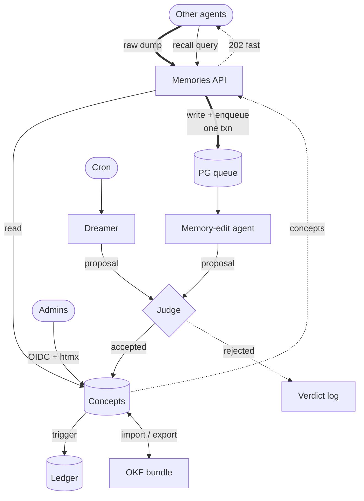

# OKF-in-a-Box — High-Level Design Spec (the WHY)

> **Status:** Draft for alignment. This document captures *design decisions and their
> rationale*. It deliberately avoids critical user journeys (CUJs), endpoint contracts,
> schemas-to-the-column, and test plans — those live in `technical-spec.md`, which is
> written after this document is agreed. Read this to understand *why* the system is
> shaped the way it is; read the technical spec to understand *what to build and how to
> prove it works*.

---

## 1. Thesis — the problem above the problem

The narrow framing is "implement the Open Knowledge Format as a microservice." That is
not the real problem. The real problem is this:

**Autonomous agents generate knowledge at high volume and low trust. Humans need that
knowledge to stay coherent, correct, and portable. Nobody wants to hand-curate it, and
nobody wants to be locked into a vendor's catalog to store it.**

So what we are actually building is a **governed, self-maintaining knowledge base** with
three faces:

1. **A machine read/write hot path** — other agents both *write* memories to us (fire a
   raw dump and get out of the way) and *read* memories back from us (recall relevant
   knowledge to ground their own work). We sit on their critical path, so writes must be
   quick to acknowledge and durable before they are clever, and reads must be fast and
   synchronous. This is a full **Memories API**, not a one-way ingest funnel.
2. **A human oversight plane** — an admin console where people with the right role can see
   what the agents wrote, how it changed over time, and correct the record.
3. **A portability boundary** — the whole corpus imports from and exports to a
   vendor-neutral, plain-markdown format so the knowledge outlives us, our database, and
   our employer.

OKF is the answer to face #3. Postgres, CrewAI, and RBAC are the answers to faces #1 and
#2. Everything below is a facet of *governance*: the judge, the dreamer, the ledger, the
role hierarchy, the review-on-import — these are not separate features, they are the
mechanisms by which low-trust machine output becomes trustworthy institutional memory.

Keep that lens. When a design choice is unclear, the tie-breaker is: *does this make the
knowledge more trustworthy, more durable, or more portable, at acceptable cost on the hot
path?*

---

## 2. What OKF is, and what we are doing differently

The [Open Knowledge Format v0.1](https://github.com/GoogleCloudPlatform/knowledge-catalog/blob/main/okf/SPEC.md)
is deliberately minimal. The entire contract:

- A **bundle** is a directory tree of markdown files.
- Each non-reserved `.md` file is a **concept**. Its **identity is its path** with `.md`
  stripped (`tables/orders.md` → concept `tables/orders`).
- Each concept has a **YAML frontmatter** block. The *only* required field is `type`.
  Recommended-but-optional: `title`, `description`, `resource`, `tags`, `timestamp`.
  Producers may add any keys they like.
- `index.md` (directory listing) and `log.md` (update history) are **reserved filenames**.
- Concepts **cross-link** with ordinary markdown links (bundle-absolute `/…` preferred).
  A link asserts a *relationship*; the type of relationship lives in the surrounding
  prose, not the link. The tree is therefore a **graph**, not a hierarchy.
- Consumers **must be lenient**: never reject a bundle for missing optional fields,
  unknown `type` values, unknown keys, broken links, or missing `index.md`. The format is
  designed to survive being half-generated by agents and refactored underneath you.

That permissiveness is a feature of the *interchange* format. It is a liability as an
*operational* store — you cannot run RBAC, staleness sweeps, provenance, or fast queries
against a pile of lenient markdown. So:

**We are not a filesystem service. We are a Postgres-native microservice that speaks OKF
only at its import/export boundary.** Internally we hold a strict, indexed, relational
model with full history and access control. At the edge we translate: permissive OKF in →
strict internal model (fill defaults, record what was missing); strict internal model out
→ conformant OKF bundle (tarball of the directory tree, `index.md`/`log.md` generated).

This is the central architectural decision and it drives everything else. The filesystem
tree is a *serialization*, not our source of truth. Our source of truth is the database.

---

## 3. System shape

Three planes, one database. Note the **read/write asymmetry** at the Memories API: *writes*
take the slow governed path (durable capture → queue → agent → judge → concepts), while
*reads* go straight from the current-state concepts table and return synchronously — no
queue, no judge, no LLM. The web tier acknowledges writes fast and hands off; the workers
do the slow LLM work off the hot path; the judge is the choke point every *autonomous*
write passes through; Postgres is simultaneously the durability boundary, the job queue,
the version store, and the graph store.

---

## 4. Core design decisions

Each subsection states the decision, the reasoning, and the alternative we rejected.

### 4.1 Postgres is the whole box

**Decision.** One Postgres instance is the durability boundary, the async job queue
(`FOR UPDATE SKIP LOCKED` via [procrastinate](https://procrastinate.readthedocs.io/) or
`pgqueuer`), the version ledger, and the concept graph. No Redis, no RabbitMQ, no separate
search cluster.

**Why.** The service is named *in-a-box* for a reason: it must stand up with one
`docker compose up` into a generic corporate environment. Every additional stateful
service is another thing to deploy, back up, secure, and fail independently. More
concretely, a Postgres-native queue lets the ingest endpoint **write the raw dump and
enqueue its derivation job in a single transaction**. Either both commit or neither does;
there is no dual-write window where we've acknowledged a memory the worker will never see.
That property is worth more than any broker's fancier scheduling. Our SLOs are lax (LLM
latency dominates any agentic hot path we sit on), so we do not need a broker's throughput.

**Rejected.** Redis+Celery (a second stateful service and a dual-write with its own
failure modes); in-process asyncio tasks (lose work on crash, can't scale workers
independently of the web tier).

### 4.2 Two-stage ingestion: raw source of truth, then derived memory

**Decision.** A memory push is a two-stage pipeline with a hard durability line between the
stages.

1. **Capture.** The endpoint receives a raw dump — the calling agent's prompt context, a
   conversation slice, whatever it wants remembered — and writes it verbatim and
   **immutable** to a `raw_dumps` table. It enqueues a derivation job in the same
   transaction and returns `202 Accepted` immediately. This is all that happens on the hot
   path.
2. **Derive.** A worker runs the **memory-edit agent**, which reads the raw dump and
   produces a *proposed* OKF concept (a new concept or an edit to an existing one). That
   proposal goes to the judge (§4.3). If accepted, it lands in the `concepts` table.

**Why.** The raw dump is the source of truth; the wiki concept is a *lossy, opinionated
derivation* of it. Separating them means (a) we acknowledge fast, before any LLM runs, (b)
if the memory-edit agent or its prompt improves later, we can **re-derive** from the
original raw material rather than from an earlier agent's summary of it, and (c) every
concept carries **provenance** — a link back to the exact raw dump(s) it came from, so a
human can always audit "why does the wiki claim this?" down to the verbatim input. This is
the OKF `resource`/cross-link idea turned inward: the concept's ultimate resource is the
raw dump that spawned it.

**Rejected.** Deriving synchronously on the request (puts an LLM on the hot path);
throwing away the raw input after derivation (destroys re-derivation and provenance).

### 4.3 The judge-gated autonomous-write invariant

**Decision.** **Every write to the wiki that originates from an autonomous agent passes
through the LLM-as-judge.** The memory-edit agent and the dreamer both emit *proposals*,
never direct writes. The judge accepts, rejects (with a recorded verdict), or defers a
proposal against quality criteria and the state of related concepts.

Human edits made through the admin console by `editor` and above are **direct writes** —
they do not pass the judge. Humans are trusted committers; the ledger trigger (§4.5)
records their change either way.

**Why.** The judge exists to guard the *untrusted, high-volume, unattended* path. That is
the autonomous agents — they hallucinate, they duplicate, they drift. A human deliberately
editing in the console is the opposite: low-volume, accountable, already gated by RBAC.
Routing human edits through an LLM would add latency and cost to the one path that doesn't
need policing, and would be insulting to the operator. Framing the invariant as "the judge
gates *autonomous* writes" (not "all writes") keeps the choke point exactly where the risk
is.

> **Flagged for Nathan to attack:** this is a real position, not a foregone conclusion.
> The alternative is "judge gates *everything* including human edits" for a uniform
> write-path. I think that's wrong for the reasons above, but it's the kind of invariant
> that's painful to change later, so let's decide it deliberately.

### 4.4 The dreamer — scheduled self-maintenance

**Decision.** A cron-scheduled **dreamer agent** periodically sweeps the wiki for stale or
incoherent records (driven by the `timestamp` field, provenance age, orphaned links, and
duplication) and emits proposed edits — which go through the same judge gate as everything
else autonomous. The dreamer is also **summonable on demand** to consolidate an
import-conflict diff (§4.7).

**Why.** OKF knowledge rots: the underlying asset changes, the raw dumps pile up,
duplicates accrete. Someone has to garden. Doing it as scheduled proposals through the
existing gate means the maintenance path reuses the trust machinery instead of inventing a
privileged back door. The dreamer is just another proposer.

### 4.5 Versioning — current table plus a trigger-maintained full-text ledger

**Decision.** Two tables per versioned entity:

- `concepts` — **current state only.** Normal CRUD. This is what serves reads fast.
- `concept_ledger` — **append-only, full text of the article at each edit** (not diffs),
  written by **hand-rolled Postgres triggers** on the concepts table, timestamped.

The application interacts only with the current-state table through ordinary CRUD;
Postgres handles the time-travel bookkeeping via triggers. Concurrency is handled by
**Postgres row locking and transactions** — we do not hand-roll locking in the app; the
ledger insert rides inside the same transaction as the CRUD write. Timestamps on the
ledger let the UI **navigate by time**; git-like diffs and history traversal are **computed
on read** from adjacent full-text snapshots. `log.md` on export is generated from the
ledger.

**Why.** Full-text snapshots (vs. diffs) make time-travel and re-rendering trivial — any
past version is a single row, no diff-chain replay, no corruption cascade if one diff is
wrong. Triggers keep the history-keeping *out of the application code*, so there is exactly
one way to mutate a concept (CRUD on the main table) and history can never be forgotten by
a code path that skipped the bookkeeping. Leaning on Postgres transactions for concurrency
is the boring, correct answer: the ledger row and the concept row commit together or not at
all. Storage cost is real but cheap; markdown is small and this is knowledge we explicitly
want to keep forever.

**Rejected.** Diff-based history (replay cost, fragility); app-code-maintained history
(easy to bypass); Dolt as the concept store (couples the app DB to a second engine and
undercuts the Postgres-native story — Dolt stays where it already is, for beads issue
tracking).

### 4.6 The OKF ↔ relational mapping

**Decision.** The internal model, sketched (columns are illustrative; the technical spec
nails them down):

- `raw_dumps` — immutable source-of-truth inputs. `(id, payload, producer_principal, received_at, …)`
- `concepts` — current state. `(concept_path PK, type, title, description, resource, tags[], okf_timestamp, body_md, frontmatter_extra JSONB, …)`. The recommended OKF fields get real typed columns (they're queryable); everything else a producer sends lives in `frontmatter_extra` JSONB so we honor OKF's "any additional keys" rule losslessly.
- `concept_ledger` — append-only full-text history (§4.5).
- `concept_links` — the graph edge table, parsed out of body markdown links plus explicit provenance edges to `raw_dumps`. Lets us answer "what links here / what is orphaned / what did the dreamer break" as SQL.
- `edit_proposals` + `judge_verdicts` — the audit trail of the gate (§4.3): what was proposed, by which agent, from which raw dump, what the judge decided and why.
- RBAC tables — `principals` (human and service), `roles`, `api_keys` (§4.8, §4.9).
- import staging tables (§4.7).

**Why.** Concept identity = path matches OKF exactly, so import/export is a near-identity
mapping and round-tripping is cheap. Typed columns for the five recommended fields give us
fast filtered queries and a clean admin UI; JSONB for the rest means we never lose a
producer's custom keys and never reject a bundle for having them (OKF leniency, honored).
The `concept_links` table turns OKF's implicit graph into something we can actually query
and garden.

### 4.7 Import / export — the portability boundary

**Decision.**

- **Export** is always available: serialize the current concepts to an OKF directory tree,
  generate `index.md` per directory and `log.md` from the ledger, tar it up. Fully
  conformant, vendor-neutral, re-importable anywhere.
- **Import is an owner/admin-only event** — deliberately heavyweight, not something an
  editor triggers casually. We parse the incoming bundle *leniently* (per OKF), then merge
  against existing concepts by path identity.
- **On collision** (incoming concept path == existing concept path), we present a
  **git-style diff review** in the console. The admin resolves like a merge/rebase:
  accept incoming, keep local, or hand-merge. Additionally, a **"summon the dreamer"
  button** hands the diffed view to the dreamer agent to propose a consolidated merge,
  which the admin then reviews.

**Why.** Import mutates the whole corpus and can silently clobber curated local knowledge
with stale or foreign data — that is an owner/admin blast radius, not an editor one.
Git-style review is the mental model engineers already have for "two versions of the same
thing disagree," and it keeps a human in the loop for the one operation where automated
last-write-wins is genuinely dangerous. The dreamer-assist gives the leverage of automation
(consolidate 200 conflicts) without removing the human's final say. Note this is a
*different* path from the judge gate: imports are human-driven-with-agent-assist, whereas
routine agent memories are agent-driven-with-human-oversight. Both keep a human on the
dangerous side of the line.

**Rejected.** Fully automated timestamp last-write-wins (clobbers curated knowledge
silently); forcing every import conflict through the LLM judge with no human diff view
(removes the human from a high-blast-radius operation).

### 4.8 RBAC and the human IDP

**Decision.** Four roles, strictly ordered: **owner → admin → editor → reader.** Owners
are **bootstrapped from environment variables at deploy time** (so a fresh box has a way
in without a chicken-and-egg IDP problem); every other role is managed in the database
through the admin console. Human authentication is **OIDC**, and we ship with **Keycloak**
as the default, self-hosted IDP so the box is complete out of the gate — but we build to
the OIDC standard so any org can **swap in their own IdP** (Okta, Entra, Auth0, Ping) by
configuration, not code.

**Why.** Owner-by-env solves bootstrap cleanly and keeps the ultimate authority outside the
database's own access-controlled surface (you can't lock yourself out by editing a row).
Keycloak-as-default honors the in-a-box thesis; OIDC-not-Keycloak-specific honors the
"generic corporate deployment" requirement — nobody adopts a service that forces its own
identity provider on them. This is the craftsman move: build to the open standard, ship a
working default, don't marry the default.

### 4.9 Agent-to-service authentication

**Decision.** **Both, pluggable, with API keys as the default-on path.**

- **API keys** (hashed at rest, issued and revoked in the admin console, each mapped to a
  service principal and RBAC role) are the out-of-the-box default. A calling agent sends
  `Authorization: Bearer okf_sk_…` and it works the moment the container is up — *no
  Keycloak configuration required*.
- **OIDC client-credentials** (each agent gets a Keycloak service-account client, uses the
  `client_credentials` grant) is opt-in, for orgs that want machine identity unified under
  their existing IdP.

Both extractors resolve to the **same internal abstraction**: a `service-principal → RBAC
role`. The auth middleware simply tries both token formats and feeds one resolver.

**Why (and the norm question, answered).** Product APIs that expect external callers —
Stripe, OpenAI, Anthropic, GitHub PATs, SendGrid — near-universally use **API keys**;
they're what an integrating developer reaches for, with no refresh dance on the hot path,
trivial revocation, and per-key scoping. Enterprises that have *already* standardized
machine identity on an IdP use **OIDC client-credentials / service accounts** (Keycloak
service clients, GCP service accounts, AWS IAM roles, SPIFFE/mTLS at the heavy end) for one
identity plane and central revocation. Real orgs do both; which is "correct" depends
entirely on whether the deployment already runs an IdP for *machines*. Pluggable is
therefore the honest answer and it's cheap — the cost is one extra token extractor, because
both paths converge on the same principal-resolution logic. API keys are default-on
specifically so the out-of-the-box experience doesn't require standing up IdP machine
identity first; that's the whole in-a-box thesis applied to auth.

### 4.10 LLM provider abstraction

**Decision.** A single **model-provider interface** with swappable backends:

1. **Local OpenAI-compatible server** (Ollama / llama.cpp / vLLM) — the default for local
   development. CrewAI runs on litellm, so any OpenAI-compatible endpoint is first-class;
   we point it at `localhost`.
2. **CLI shell-out adapters** — wrap the `claude` CLI (`-p`/headless) and/or the GitHub
   Copilot CLI as a provider, so developers who lack the silicon for a decent local model
   can drive the agents with a subscription they already pay for.

Setup instructions for a local LLM server on **Linux and macOS** are a first-class
deliverable (they belong in the technical spec / README, but the requirement is recorded
here).

**Why.** Local-first keeps development free, private, and offline-capable, and proves the
system doesn't depend on any single vendor's cloud (mirrors OKF's own vendor-neutrality).
The CLI shell-out is a pragmatic on-ramp: not everyone has a 4090 or an M-series with
enough unified memory, and asking developers to burn API credits to *try the thing* is a
barrier. The constraint to note for the technical spec: the OpenAI-compatible path is
trivial through litellm, but the **CLI shell-out needs a custom LLM wrapper** (a litellm
custom provider or a CrewAI custom LLM class) that marshals prompts to the CLI and parses
its output — that's real work, not a config flag, so it may land as a fast-follow rather
than day one.

### 4.11 Web stack — Litestar + htmx, server-rendered

**Decision.** [Litestar](https://litestar.dev/) (async ASGI, formerly Starlite) serves both
the machine JSON API (with generated OpenAPI for the agent-facing endpoints) and the human
admin console, which is **server-rendered HTML with htmx** for interactivity — diff views,
review queues, history navigation — with **no SPA**.

**Why.** htmx server-rendering keeps the console a thin, legible layer over the same
backend the agents hit, with no separate frontend build, no client-side state store, no API
duplication for the sake of a JavaScript framework. The console is fundamentally CRUD +
diff-review + queues — exactly what hypermedia does well. This is the anti-brain-rot choice:
the complexity stays in the domain, not in a client bundle.

### 4.12 The read/write asymmetry, restated

The Memories API has two hot-path shapes and they are optimized differently.

**Writes are async.** Ingest endpoints do the minimum: validate auth, write the raw dump,
enqueue the derivation job, return `202`. Everything expensive — the memory-edit agent, the
judge, the dreamer's sweeps — runs in worker processes pulling from the Postgres queue.
Workers scale independently of the web tier.

**Reads are synchronous.** Recall endpoints serve directly from the current-state
`concepts` table (and its indexes) — no queue, no judge, no LLM in the loop. A calling agent
asking "what do we know about X" gets an answer in one round trip. Reads never mutate and
never propose, so they skip the entire governance path. This is why the concepts table is
tuned for fast filtered/lookup/search reads while the raw dumps and ledger are tuned for
durable append.

Because our SLOs are dominated by LLM latency in the callers' own pipelines, we optimize the
*write-acknowledgement* path and the *read* path hard, and let the *derivation* path take
the time it needs.

---

## 5. The caller contract — how agentic systems talk to us

A calling system (typically a CrewAI crew, but the contract is framework-agnostic) uses us
in two directions, the way a human uses an llm-wiki.

**Writing ("remember this").** Before or as a crew completes a unit of work, it POSTs its
**prompt context / relevant conversation slice** to our write endpoint as a raw dump,
authenticated by API key. It gets an immediate `202`; it does **not** wait for a wiki
concept to be produced. We handle derivation and judging asynchronously. The caller's job
here is trivial and non-blocking — dump raw material, move on. All the intelligence is on
our side of the boundary.

**Reading ("what do we already know?").** Before or during its work, a crew queries our
read endpoints to pull relevant memories into its own context — by concept path, by
type/tag, or by search over the corpus — and grounds its reasoning on what the wiki already
holds. This is synchronous and fast (§4.12); the caller gets concepts back in the response.
The recall side is what makes us a *memory*, not just an audit sink: agents that write to
us later read from us (or each other's contributions) to avoid re-deriving what the swarm
already learned.

We will provide guidance (and likely a thin client / drop-in CrewAI tools — one to save
context, one to recall) for wiring both directions up, so a crew can be told, in effect,
"check the memory service before you start, and send your context to it before you finish."
The exact shape of those helpers is technical-spec material; the design commitment here is
that **both directions are cheap for the caller** — recall is one synchronous query, save
is one fire-and-forget POST.

---

## 6. Deployment — the "in-a-box" promise

One `docker compose up` brings up: Postgres, Keycloak (default IdP), the Litestar app, the
worker(s), and optionally a local LLM server. Owners are set via environment variables.
Swapping the IdP is configuration (OIDC issuer URL + client), and swapping the LLM backend
is configuration (provider + endpoint). A generic corporate deployment should be able to
adopt the service without reading our source — point it at their IdP, point it at their
model, set the owners, go.

---

## 7. Non-goals / explicitly deferred

- **Not a filesystem-native OKF tool.** We speak OKF only at import/export; the DB is
  truth. (§2)
- **Not a general search platform.** Postgres full-text / trigram is the ceiling for now;
  no Elasticsearch.
- **No multi-tenant isolation** in v1 unless a requirement surfaces — one box, one org.
- **No custom locking / eventual-consistency machinery** — Postgres transactions are the
  concurrency model. (§4.5)
- **CLI shell-out LLM adapters may be a fast-follow**, not day-one, given the custom-wrapper
  cost. (§4.10)

---

## 8. Open questions still to resolve (before or during the technical spec)

1. **Judge scope** (§4.3) — confirm the "autonomous writes only, humans bypass" invariant.
   This is the one I most want challenged.
2. **Provenance cardinality** — can one concept derive from *many* raw dumps over time
   (accretion), and does re-derivation supersede or append? Affects `concept_links` and the
   ledger semantics.
3. **Judge rejection handling** — on reject, do we discard, park for human review, or feed
   back to the memory-edit agent for a bounded retry loop? Leaning "park + surface in
   console."
4. **Dreamer cadence & scope controls** — how do owners bound what the dreamer may touch and
   how often, so it can't run up a large LLM bill or mass-rewrite the corpus unattended?
5. **`index.md` / `log.md` generation fidelity** — how faithfully do we reproduce OKF §6/§7
   structure on export, and do we ingest producer-authored `index.md`/`log.md` on import or
   regenerate ours? (Technical-spec detail, flagged here so it isn't forgotten.)
6. **Local model floor** — which local model(s) do we validate the agents against, so
   "works on my machine" has a defined baseline for the setup docs?

---

## 9. Glossary

- **Concept** — one OKF markdown document; a single unit of wiki knowledge. Identity = path.
- **Bundle** — an OKF directory tree; our import/export unit (a tarball).
- **Raw dump** — the verbatim, immutable input an agent sends us; the source of truth from
  which concepts are derived.
- **Memory-edit agent** — the worker agent that turns a raw dump into a proposed concept.
- **Judge** — the LLM-as-judge that gates every autonomous write.
- **Dreamer** — the scheduled maintenance agent that proposes edits to keep the wiki fresh
  and coherent, and assists import-conflict consolidation.
- **Ledger** — the append-only, full-text, trigger-maintained version history of concepts.
- **Principal** — an authenticated actor: a human (via OIDC) or a service (via API key or
  OIDC client-credentials), each bound to an RBAC role.
