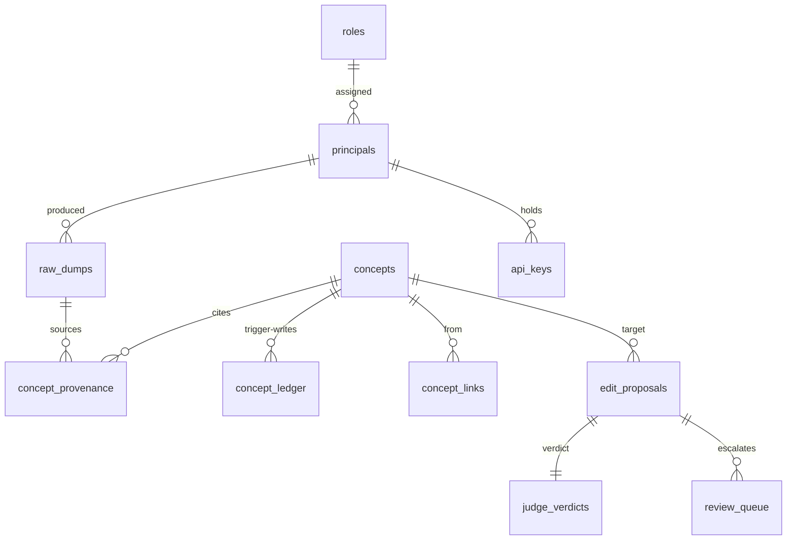

# OKF-in-a-Box — Technical Implementation Spec (the HOW)

> **Status:** Draft, in progress. This is the *implementation* companion to
> [`design-spec.md`](./design-spec.md). Where the design spec argues **why** the system is
> shaped the way it is, this document specifies **how** it is built and **how we prove it
> works**: the layered architecture, the local dev environment, the concrete data model and
> API contracts, the Critical User Journeys (CUJs), and the testing strategy tied to them.
>
> Section-by-section authoring is tracked in beads under epic `okf-in-a-box-00z`. Sections
> not yet filled are marked _(pending — TS#)_.

---

## 1. Purpose, scope, and how to read this

### 1.1 What this document is

The design spec settled the decisions: Postgres is the whole box; a two-stage
raw-dump → distilled-concept pipeline; a tiered judge gate; a dreamer under hard guardrails;
hybrid retrieval; a hot-core priming layer; OKF only at the import/export boundary; per-agent
models against the org's AI gateway. **This document does not re-argue any of that.** It
takes those decisions as fixed and specifies the buildable artifact:

- the **architecture** — an n-tier layered application following Litestar's idioms, and where
  each design-spec concept lives in code (§3);
- the **local dev environment** — everything a contributor needs to run the whole system on a
  laptop, on Linux or macOS (§4);
- the **data model** — concrete tables, indexes, triggers, and migrations (§5);
- the **API** — endpoint contracts for the machine hot path, the admin console, and
  import/export (§6);
- the **Critical User Journeys** — the end-to-end flows every actor takes, which are the
  backbone of both the implementation and the tests (§7);
- the **testing strategy** — integration-first, tied one-to-one to the CUJs (§8);
- **cross-cutting concerns** and **build/CI** (§9, §10).

### 1.2 Scope and non-goals

**In scope:** the concrete shape of the v1 service — modules, tables, endpoints, journeys,
tests, dev setup. Enough that an implementer (human or agent) can pick up a bead and build a
slice without re-deriving design intent.

**Out of scope / deferred (per design-spec §7, §8):** the v2 three-tier crypto-shred +
pseudonymised-snapshot retention model; CLI-shell-out LLM wrappers as a production path
(dev-only); any multi-tenant/RBAC-region isolation (sensitive knowledge → a separate
deployment). These are noted where they touch a v1 seam, but not specified here.

### 1.3 Relationship to the design spec

Every major section cross-references the design-spec section it implements. The mapping:

| design-spec (WHY) | technical-spec (HOW) |
|---|---|
| §3 system shape, §4.1 Postgres-is-the-box | §3 Architecture, §5 Data model |
| §4.2 two-stage ingestion, §4.12 read/write asymmetry | §6 API, §7 CUJs (hot path + pipeline) |
| §4.3 tiered judge gate | §7 CUJs (pipeline), §8 tests |
| §4.4 dreamer guardrails | §7 CUJs (pipeline) |
| §4.5 ledger, §4.6 relational mapping | §5 Data model + triggers |
| §4.7 import/export | §6 API, §7 CUJs (admin ops) |
| §4.8/§4.9 RBAC + auth | §3 (guards/middleware), §6 (auth), §7 (console CUJs) |
| §4.10 models / AI gateway | §4 dev env, §8 (deterministic agent testing) |
| §4.14 hybrid retrieval | §5 (pgvector + FTS indexes), §7 (recall CUJ) |
| §4.15 sanitization seam + PII knobs | §3 (decorator seam), §9 security |
| §4.16 tags / sensitive deployment | §5 (tags), §7 (admin ops) |
| §4.17 priming / hot core | §5 (`core` marker), §6 (`prime`), §7 (prime CUJ) |
| §5 caller contract, §8 integration | §6 API, §7 CUJs (agent-facing) |

Terminology is shared with the design-spec glossary (§9 there); this doc adds
implementation terms as they arise.

---

## 2. System context (recap)

_A one-screen recap of the runtime topology from design-spec §3, so this doc stands on its
own for an implementer. (Pending — TS1.)_

---

## 3. Architecture — n-tier, following Litestar defaults

_Layered structure (controllers → services → repositories → models/DTOs), dependency
injection, auth guards/middleware, the sanitization decorator seam, the worker tier
(procrastinate), the CrewAI agents, and the concrete module/package layout. Component
diagram. Where each design-spec concept lives in code. (Pending — TS1.)_

---

## 4. Local development environment

_uv + Python 3.13, docker-compose (Postgres+pgvector, Keycloak, optional local LLM server),
owner bootstrap env vars, Makefile targets, the three model backends, embedding model, seed
data. Step-by-step for Linux and macOS. (Pending — TS2.)_

---

## 5. Data model, migrations, and triggers

Implements design-spec §4.5 (ledger), §4.6 (relational mapping), §4.14 (retrieval indexes),
§4.15 (retention/access), §4.16 (tags), §4.17 (hot core). One Postgres database; extensions
`vector` (pgvector) and `pg_trgm`. Column lists are the v1 shape — illustrative but concrete
enough to build and migrate against; DTOs (§3) decouple these from the wire format.

### 5.1 Entity overview

Two axes to keep straight: the **write/governance side** (`raw_dumps` → `edit_proposals` →
`judge_verdicts` → `concepts`, with `review_queue` as the escalation sink) and the
**history/provenance side** (`concept_ledger` full-text versions + `concept_provenance`
source edges). Reads serve from `concepts` only.

### 5.2 Tables

**`raw_dumps`** — immutable source-of-truth inputs (design-spec §4.2). Never updated.

| column | type | notes |
|---|---|---|
| `id` | `uuid` PK | |
| `producer_principal_id` | `uuid` FK→principals | who sent it |
| `payload` | `text` | verbatim, post-sanitization-seam (§9); candidate for encryption at rest (§4.15) |
| `content_meta` | `jsonb` | source hints (crew/task id, tags requested) |
| `received_at` | `timestamptz` | |
| `expires_at` | `timestamptz` NULL | NULL = keep forever (default); set by max-TTL knob; purge sweep deletes where `now() > expires_at` |

**`concepts`** — current state; the *only* table reads touch. Identity = OKF path.

| column | type | notes |
|---|---|---|
| `concept_path` | `text` PK | OKF identity, e.g. `tables/orders` |
| `type` | `text` NOT NULL | the one required OKF field |
| `title`, `description`, `resource` | `text` NULL | recommended OKF fields, typed for query |
| `okf_timestamp` | `timestamptz` NULL | OKF `timestamp` (last meaningful change, producer-asserted) |
| `tags` | `text[]` | GIN-indexed; namespacing + scoping (§4.16) |
| `body_md` | `text` | the markdown body |
| `frontmatter_extra` | `jsonb` | any non-recommended producer keys, lossless (OKF leniency) |
| `is_core` | `boolean` default false | hot-core marker (§4.17); with `tags` gives global + per-domain cores |
| `search_tsv` | `tsvector` GENERATED | from title/description/body; GIN-indexed (FTS) |
| `embedding` | `vector(N)` | over the distilled concept; HNSW-indexed (semantic) |
| `updated_at`, `created_at` | `timestamptz` | |

**`concept_ledger`** — append-only full-text version history (§4.5). **Written only by the
trigger in §5.3**, never by app code.

| column | type | notes |
|---|---|---|
| `id` | `bigint` PK | |
| `concept_path` | `text` | not FK-constrained (must survive concept deletion) |
| `revision` | `int` | monotonic per path |
| `type`,`title`,`description`,`resource`,`tags`,`body_md`,`frontmatter_extra`,`is_core` | — | full snapshot of the row at that revision (not a diff) |
| `edited_by_principal_id` | `uuid` | human or agent principal |
| `edit_proposal_id` | `uuid` NULL | links to the gate audit when the edit came from an agent |
| `op` | `text` | `create` / `update` / `delete` |
| `recorded_at` | `timestamptz` | time-travel axis for the UI |

**`concept_provenance`** — many-dumps→one-concept source edges (§4.2, §4.6). Soft-invalidated,
never deleted.

| column | type | notes |
|---|---|---|
| `id` | `bigint` PK | |
| `concept_path` | `text` | |
| `raw_dump_id` | `uuid` FK→raw_dumps | |
| `contribution_role` | `text` | e.g. `origin`, `refinement`, `correction` |
| `cited_claims` | `jsonb` NULL | which claims this dump justified (memory-edit agent citation) |
| `valid_at` | `timestamptz` | |
| `invalid_at` | `timestamptz` NULL | soft-invalidation (set on re-derivation supersession) |
| `invalidation_reason` | `text` NULL | machine-readable "why deprecated" |

**`edit_proposals`** — every autonomous write attempt (§4.3). The audit spine of the gate.

| column | type | notes |
|---|---|---|
| `id` | `uuid` PK | |
| `concept_path` | `text` | target (may not yet exist) |
| `proposer` | `text` | `memory_edit` / `dreamer` |
| `source_raw_dump_id` | `uuid` NULL | for memory-edit proposals |
| `proposed_body_md`, `proposed_frontmatter` | — | the candidate |
| `attempt` | `int` default 0 | bounded-repair counter (max 1 retry, §4.3) |
| `status` | `text` | `pending`/`accepted`/`rejected`/`repairing`/`escalated` |
| `created_at` | `timestamptz` | |

**`judge_verdicts`** — one per judged proposal (privacy + quality).

| column | type | notes |
|---|---|---|
| `id` | `uuid` PK | |
| `edit_proposal_id` | `uuid` FK | |
| `screen` | `text` | `privacy` / `quality` |
| `decision` | `text` | `accept`/`reject` |
| `reason_class` | `text` | `pii`/`secret`/`redundant`/`vague`/`inconsistent`/… (routes handling) |
| `rationale` | `text` | structured, actionable critique (feeds repair) |
| `judge_model` | `text` | recorded; must differ from proposer model (§4.4) |
| `created_at` | `timestamptz` | |

**`review_queue`** — the owned human escalation sink (§4.3): repair-exhausted, privacy-
ambiguous rejections, and advisory-flagged human edits.

| column | type | notes |
|---|---|---|
| `id` | `uuid` PK | |
| `kind` | `text` | `rejected_proposal` / `flagged_human_edit` |
| `ref_id` | `uuid` | proposal or ledger row |
| `priority` | `int` | triage lane |
| `status` | `text` | `open`/`claimed`/`resolved` |
| `owner_role` | `text` | who may triage (alerting on queue depth — §9) |
| `created_at`, `resolved_at` | `timestamptz` | |

**RBAC (§4.8, §4.9).**

- **`roles`** — `(name PK)`; seeded `owner`,`admin`,`editor`,`reader` with a strict ordering.
- **`principals`** — `(id PK, kind[human|service], display_name, external_subject NULL, role_name FK, disabled_at NULL)`. `external_subject` = OIDC `sub` for humans and OIDC service accounts; NULL for pure API-key services. Owners are reconciled from env at boot (§4.8).
- **`api_keys`** — `(id PK, principal_id FK, hash, prefix, created_at, last_used_at, revoked_at NULL)`. Only the hash is stored; `prefix` (e.g. `okf_sk_ab12…`) enables display + lookup.

**Import staging (§4.7).** `import_batches (id, actor_principal_id, source, status, created_at)`
and `import_staged_concepts (id, batch_id, concept_path, incoming_body_md, incoming_frontmatter, collision[none|conflict], resolution[pending|accept_incoming|keep_local|merged], merged_body_md NULL)`.
Producer-authored `index.md`/`log.md` are **not** staged (ignored on import, §4.7).

**Queue.** The `procrastinate` schema (its own tables) lives in the same database, so a
raw-dump insert and its derivation-job enqueue commit in one transaction (§4.1). Jobs:
`derive_concept(raw_dump_id)`, `judge_proposal(edit_proposal_id)`, `dreamer_sweep()`,
`purge_expired_dumps()`.

### 5.3 The ledger trigger

History is kept **out of application code** (§4.5): exactly one way to mutate a concept
(CRUD on `concepts`), and the trigger guarantees history can never be skipped.

- An `AFTER INSERT OR UPDATE OR DELETE ON concepts FOR EACH ROW` trigger writes a full
  snapshot row into `concept_ledger`, computing `revision = coalesce(max(revision),0)+1` for
  that `concept_path`, stamping `op` and `recorded_at`, and carrying the
  `edited_by_principal_id` / `edit_proposal_id` supplied by the transaction (passed via a
  transaction-local `SET LOCAL okf.actor = …` GUC that the trigger reads, so the writer
  doesn't have to touch the ledger table).
- The insert rides **inside the same transaction** as the CRUD write — both commit or neither
  (§4.5). Concurrency is Postgres row locking + transactions; no app-level locking.
- **Re-derivation** (§4.2) is a normal `UPDATE` (supersede current) → trigger appends the
  prior state to the ledger (append history). Superseded `concept_provenance` edges get
  `invalid_at`/`invalidation_reason` set in the same transaction.
- `log.md` on export (§4.7) is a fold over `concept_ledger` grouped by `recorded_at::date`.
- Diffs/time-travel in the console (§7 CUJ-H5) are computed on read from adjacent snapshots.

### 5.4 Indexes for hybrid retrieval

Per design-spec §4.14 (all in Postgres):

- **FTS:** `GIN (search_tsv)` for lexical/exact (error codes, identifiers). `search_tsv` is a
  `GENERATED` column so it can never drift from the body.
- **Semantic:** `HNSW (embedding vector_cosine_ops)` for paraphrase/concept match; sized for
  a 10⁴–10⁵ corpus (RAM-resident). `halfvec` an option to halve footprint.
- **Fusion:** recall runs both and merges with Reciprocal Rank Fusion in the service layer
  (§3); RRF is a pure function → unit-tested (§8).
- **Tags/graph:** `GIN (tags)`; btree on `concept_links(target_path)` for "what links here /
  orphans." Partial index `WHERE is_core` for the cheap `prime` read (§4.17).

### 5.5 Migrations

Alembic (via advanced-alchemy's migration integration, §3). The ledger trigger and the
pgvector/pg_trgm extension creation ship as migration revisions (raw SQL in `op.execute`), so
a fresh `docker compose up` + `migrate` produces the whole schema including triggers. Purge
and dreamer schedules are procrastinate periodic tasks, not migrations.

**Retention/PII note (§4.15).** v1 is the `expires_at` column + `purge_expired_dumps` sweep
(default NULL = forever). The v2 three-tier crypto-shred + pseudonymised-snapshot model is
*not* in this schema; its future seam is a per-dump key reference on `raw_dumps` and a
`derivation_snapshots` table — noted so v1 migrations don't paint us into a corner.

---

## 6. API and endpoint contracts

Three surface groups: the **machine API** (JSON, for calling agents — the hot path), the
**admin console** (htmx-rendered HTML, for humans), and **import/export** (admin ops). Auth
and the read/write asymmetry from design-spec §4.12 govern all three. OpenAPI is generated for
the machine API (Litestar built-in, §3); the console routes are not part of the public
contract.

### 6.1 Conventions

- **Versioning:** machine API under `/v1`. Console under `/admin`.
- **Auth (§4.9):** `Authorization: Bearer <token>` on every machine call. The auth middleware
  (§3) tries two extractors — API key (`okf_sk_…`, hashed lookup) then OIDC JWT (validate
  against the configured issuer) — and resolves both to one `principal` + role. Console uses
  the OIDC browser flow (§4.8). `401` no/invalid credential, `403` role too low.
- **Error envelope:** consistent JSON `{ "error": { "code", "message", "detail"? } }` with
  the appropriate 4xx/5xx. Litestar exception handlers map domain errors to this shape.
- **Size/rate limits:** raw-dump payload capped (configurable, default e.g. 256 KiB) → `413`
  over cap; per-principal rate limit → `429`. Limits are lax (design-spec: LLM latency
  dominates) but present to bound abuse.
- **Idempotency:** `save` accepts an optional `Idempotency-Key` so a retrying caller doesn't
  double-insert a raw dump.

### 6.2 Machine API — write (async)

**`POST /v1/memories`** — the hot-path save (§4.2, CUJ-A3). Body:
`{ "payload": "<verbatim context>", "tags": ["…"], "meta": { "crew_id"?, "task_id"? } }`.

- Middleware authenticates → resolves service principal + role (needs ≥ writer-equivalent).
- Payload runs the **sanitization seam** (§9) synchronously (XSS + any org PII scrubber).
- Insert `raw_dumps` row **and** enqueue `derive_concept(raw_dump_id)` **in one transaction**
  (§4.1), then return **`202 Accepted`** with `{ "raw_dump_id", "status": "queued" }`.
- The caller does **not** wait for a concept. No concept is created on this path synchronously.
- Failure paths: `413` oversize, `429` rate, `422` malformed, `401/403` auth. The endpoint
  never blocks on the LLM.

### 6.3 Machine API — read (synchronous)

**`GET /v1/prime?tags=…&budget=…`** — the hot-core primer (§4.17, CUJ-A1). Returns the small,
size-bounded, tag-scoped set of `is_core` concepts (global + requested domains), newest/most-
central first, within an optional token/count `budget`. Cheap indexed read (partial index on
`is_core`), synchronous. Response: `{ "core": [ {concept_path, title, body_md, tags}… ],
"budget_used" }`. This is advisory — the caller decides what to pin.

**`GET /v1/recall?q=…&tags=…&type=…&k=…`** — hybrid retrieval (§4.14, CUJ-A2). Runs FTS +
vector, fuses with RRF, returns top-`k` concepts with scores:
`{ "results": [ {concept_path, title, description, body_md, tags, score}… ] }`. Also
`GET /v1/concepts/{path}` for a direct fetch by identity, and
`GET /v1/concepts/{path}/history` for the ledger view (used by console CUJ-H5; gated by role).
All reads serve from `concepts`/`concept_ledger` only — no queue, no judge, no LLM; replica-
routable (§4.13).

### 6.4 Machine API — MCP recall

An **MCP server exposes `recall` (and `prime`) as tools** (§5 design-spec, CUJ-A5) for any MCP
client. **Save is not offered over MCP as a first-class tool** (structurally can't capture
verbatim context — design-spec §5); at most a documented, lossy manual `save` tool for
non-CrewAI callers, clearly labelled. The MCP server is a thin adapter over the same service
layer as the HTTP recall.

### 6.5 Admin console (htmx)

Server-rendered HTML under `/admin`, OIDC-authenticated, role-gated by guard (§3). Route
groups map to console CUJs (§7.4):

- `/admin` dashboard — reject-rate, queue depth, dreamer activity (§9 observability).
- `/admin/concepts` — browse/search (progressive disclosure via generated index, CUJ-H6),
  view, and for `editor`+ **edit** (direct commit; advisory lint runs async, CUJ-H2/H3).
- `/admin/concepts/{path}/history` — time-travel + diff view (CUJ-H5).
- `/admin/review` — the review/patrol queue triage (CUJ-H4); `admin`+.
- `/admin/rbac` — principals, roles, API-key issue/revoke (CUJ-H1); `admin`+ (owner for owner
  changes).
- `/admin/import` — upload bundle → conflict diff review + summon-dreamer (CUJ-O1/O2); `admin`+.
- `/admin/settings` — TTL/PII knobs, model/gateway config (CUJ-O4/O5); `owner`.

htmx partials return HTML fragments for in-place updates (diff panes, queue actions); no SPA.

### 6.6 Import / export

- **`POST /v1/admin/import`** (or the console upload) — accepts an OKF bundle (tarball/dir),
  parses leniently (§4.7), stages into `import_batches`/`import_staged_concepts`, returns the
  collision set for review. Owner/admin only. Resolution endpoints apply
  accept-incoming/keep-local/merged per staged concept; a "summon dreamer" action enqueues a
  consolidation proposal (CUJ-O2).
- **`GET /v1/admin/export`** — streams a conformant OKF tarball: concept files from
  `concepts`, regenerated per-directory `index.md`, and `log.md` folded from `concept_ledger`
  (§4.7, CUJ-O3). Always available; owner/admin.

### 6.7 Health & ops

`GET /health` (liveness), `GET /ready` (DB + queue reachable). Metrics endpoint per §9.

---

## 7. Critical User Journeys (CUJs)

_The end-to-end flows, grouped by actor. This is the backbone of the implementation and the
tests. (Inventory pending — TS5; journeys pending — TS6a–d.)_

### 7.1 Actors and journey catalog

A CUJ here is an **end-to-end flow with a triggering actor, preconditions, numbered steps
across the tiers, and an observable outcome** — written so it doubles as an integration-test
script (§8). Each is tagged with an ID (`CUJ-<area><n>`) referenced by the test plan.

**Actors.**

| Actor | Kind | Interface | Trust |
|---|---|---|---|
| **Calling agent** | machine (e.g. a CrewAI crew, a Copilot) | machine API (API key / OIDC client-creds), MCP recall | untrusted, high-volume |
| **Memory-edit agent** | internal worker (CrewAI, non-interactive) | queue → LLM via gateway | untrusted output → judged |
| **Judge** | internal worker (LLM) | invoked in pipeline | the gate itself |
| **Dreamer** | internal worker (cron, CrewAI) | scheduled + summonable | untrusted output → judged |
| **Reader** | human | admin console (OIDC) | read-only |
| **Editor** | human | admin console | trusted committer (quality-bypass, privacy-gated) |
| **Admin** | human | admin console | + import, RBAC, review-queue triage |
| **Owner** | human | env-bootstrapped + console | + everything; ultimate authority |
| **Operator** | human/CI | shell, env, compose | deploys, configures gateway/IdP/TTL |

**Journey catalog** (specified in §7.2–§7.5):

- **Agent-facing hot path (§7.2, TS6a):** `CUJ-A1` prime at startup · `CUJ-A2` recall
  (hybrid) · `CUJ-A3` save a raw dump (202 + async) · `CUJ-A4` CrewAI event-bus auto-capture
  SAVE · `CUJ-A5` recall over MCP.
- **Autonomous pipeline (§7.3, TS6b):** `CUJ-P1` memory-edit distillation (dump → proposed
  concept, provenance + citation) · `CUJ-P2` privacy screen (blocks everyone) · `CUJ-P3`
  quality judge on an agent proposal (accept / reject) · `CUJ-P4` bounded repair retry ·
  `CUJ-P5` dreamer staleness sweep (dirtiness gate, caps, cooldown) · `CUJ-P6` dreamer
  reject-rate canary auto-halt · `CUJ-P7` hot-core upkeep (promote/demote under budget).
- **Human console (§7.4, TS6c):** `CUJ-H1` owner bootstrap + RBAC management · `CUJ-H2`
  editor direct edit with advisory lint · `CUJ-H3` blast-radius escalation of a human mass
  edit · `CUJ-H4` review/patrol queue triage · `CUJ-H5` version history time-travel + diff ·
  `CUJ-H6` browse the wiki as internal docs (progressive disclosure via index).
- **Admin ops (§7.5, TS6d):** `CUJ-O1` OKF import with git-style conflict diff · `CUJ-O2`
  summon-dreamer import consolidation · `CUJ-O3` export to OKF tarball (regenerate
  `index.md`/`log.md`) · `CUJ-O4` configure PII/TTL knobs · `CUJ-O5` configure models against
  the AI gateway · `CUJ-O6` stand up a sensitive deployment and route to it.

Each journey below states: **Actor · Trigger · Preconditions · Steps (tier-by-tier) ·
Outcome · Failure paths · Design-spec ref**.

### 7.2 Agent-facing hot path — prime, recall, save _(TS6a)_
### 7.3 Autonomous pipeline — memory-edit, judge, dreamer _(TS6b)_
### 7.4 Human console — RBAC, review queue, edit, history _(TS6c)_
### 7.5 Admin ops — import, export, sensitive deployment _(TS6d)_

---

## 8. Testing strategy and test plans

_Integration-first, tied one-to-one to the CUJs (testcontainers Postgres, real/mocked LLM,
deterministic agent testing, golden tests for OKF conformance + RRF + frontmatter + ledger
diffs). Unit tests for pure logic. CI coverage per CUJ. (Pending — TS7.)_

---

## 9. Cross-cutting concerns

_Config/settings, observability (reject-rate / queue-depth / cost dashboards, tracing),
security (auth middleware, XSS sanitization seam, secrets, v2 crypto-shred hook), error
handling and failure modes. (Pending — TS8.)_

---

## 10. Build, tooling, and CI/CD

_uv/ruff/mypy/pytest gates, pre-commit, Makefile standard targets, container build, migration
runs, CI matrix — reconciled with the existing repo template. (Pending — TS9.)_
