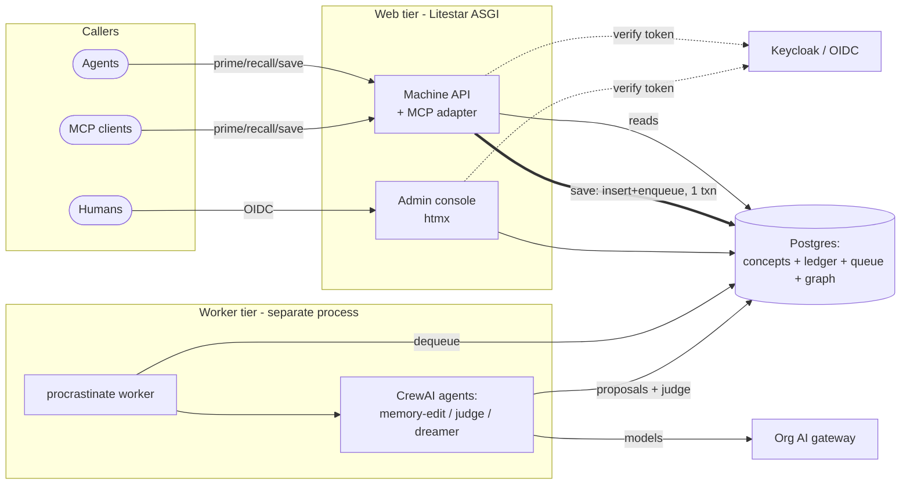
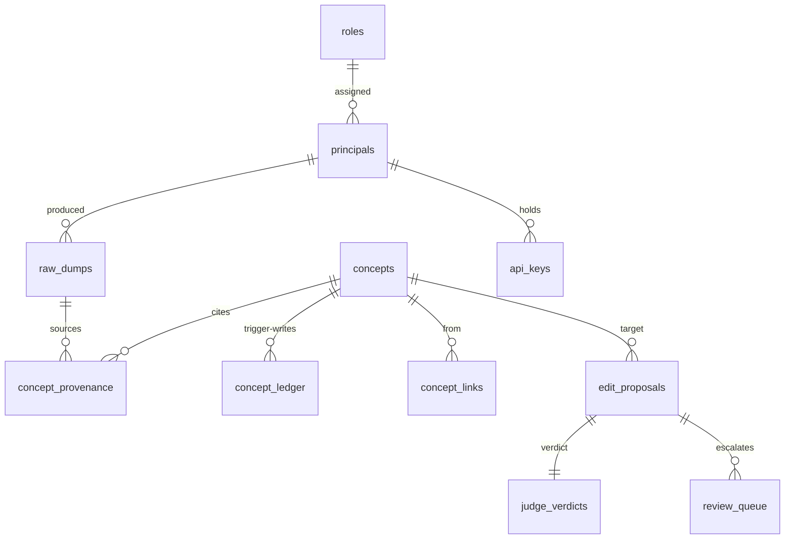

# OKF-in-a-Box — Technical Implementation Spec (the HOW)

> **Status:** Draft, in progress. This is the *implementation* companion to
> [`design-spec.md`](./design-spec.md). Where the design spec argues **why** the system is
> shaped the way it is, this document specifies **how** it is built and **how we prove it
> works**: the layered architecture, the local dev environment, the concrete data model and
> API contracts, the Critical User Journeys (CUJs), and the testing strategy tied to them.
>
> Section-by-section authoring is tracked in beads under epic `okf-in-a-box-00z`. Sections
> not yet filled are marked _(pending — TS#)_.

---

## 1. Purpose, scope, and how to read this

### 1.1 What this document is

The design spec settled the decisions: Postgres is the whole box; a two-stage
raw-dump → distilled-concept pipeline; a tiered judge gate; a dreamer under hard guardrails;
hybrid retrieval; a hot-core priming layer; OKF only at the import/export boundary; per-agent
models against the org's AI gateway. **This document does not re-argue any of that.** It
takes those decisions as fixed and specifies the buildable artifact:

- the **architecture** — an n-tier layered application following Litestar's idioms, and where
  each design-spec concept lives in code (§3);
- the **local dev environment** — everything a contributor needs to run the whole system on a
  laptop, on Linux or macOS (§4);
- the **data model** — concrete tables, indexes, triggers, and migrations (§5);
- the **API** — endpoint contracts for the machine hot path, the admin console, and
  import/export (§6);
- the **Critical User Journeys** — the end-to-end flows every actor takes, which are the
  backbone of both the implementation and the tests (§7);
- the **testing strategy** — integration-first, tied one-to-one to the CUJs (§8);
- **cross-cutting concerns** and **build/CI** (§9, §10).

### 1.2 Scope and non-goals

**In scope:** the concrete shape of the v1 service — modules, tables, endpoints, journeys,
tests, dev setup. Enough that an implementer (human or agent) can pick up a bead and build a
slice without re-deriving design intent.

**Out of scope / deferred (per design-spec §7, §8):** the v2 three-tier crypto-shred +
pseudonymised-snapshot retention model; CLI-shell-out LLM wrappers as a production path
(dev-only); any multi-tenant/RBAC-region isolation (sensitive knowledge → a separate
deployment). These are noted where they touch a v1 seam, but not specified here.

### 1.3 Relationship to the design spec

Every major section cross-references the design-spec section it implements. The mapping:

| design-spec (WHY) | technical-spec (HOW) |
|---|---|
| §3 system shape, §4.1 Postgres-is-the-box | §3 Architecture, §5 Data model |
| §4.2 two-stage ingestion, §4.12 read/write asymmetry | §6 API, §7 CUJs (hot path + pipeline) |
| §4.3 tiered judge gate | §7 CUJs (pipeline), §8 tests |
| §4.4 dreamer guardrails | §7 CUJs (pipeline) |
| §4.5 ledger, §4.6 relational mapping | §5 Data model + triggers |
| §4.7 import/export | §6 API, §7 CUJs (admin ops) |
| §4.8/§4.9 RBAC + auth | §3 (guards/middleware), §6 (auth), §7 (console CUJs) |
| §4.10 models / AI gateway | §4 dev env, §8 (deterministic agent testing) |
| §4.14 hybrid retrieval | §5 (pgvector + FTS indexes), §7 (recall CUJ) |
| §4.15 sanitization seam + PII knobs | §3 (decorator seam), §9 security |
| §4.16 tags / sensitive deployment | §5 (tags), §7 (admin ops) |
| §4.17 priming / hot core | §5 (`core` marker), §6 (`prime`), §7 (prime CUJ) |
| §5 caller contract, §8 integration | §6 API, §7 CUJs (agent-facing) |

Terminology is shared with the design-spec glossary (§9 there); this doc adds
implementation terms as they arise.

---

## 2. System context (recap)

Runtime topology (design-spec §3). Three planes over one Postgres:



Web tier acks fast and never runs an LLM on the hot path; the worker tier (a **separate
process**) runs the CrewAI pipeline off the queue; Postgres is durability + queue + version
store + graph at once. This section fixes how that maps to code.

---

## 3. Architecture — n-tier, following Litestar defaults

The "Litestar way" is defined less by the framework than by its official reference app
([`litestar-fullstack`](https://github.com/litestar-org/litestar-fullstack)) plus
[`advanced-alchemy`](https://github.com/litestar-org/advanced-alchemy) (the Litestar-org
sibling that supplies the Service and Repository tiers). We follow it: a **4-tier layered
design — Controller → Service → Repository → Model — organized domain-first** (vertical
slices), with `advanced-alchemy` providing most CRUD so we don't hand-roll it.

> **Load-bearing dependency note:** the repository/service pattern, base models, DI factories,
> and Alembic wiring come from `advanced_alchemy.extensions.litestar`, whose API moves faster
> than Litestar core — pin it explicitly (§10).

### 3.1 The four tiers and the primitive at each

| Tier | Litestar/advanced-alchemy primitive | Our use |
|---|---|---|
| **Controller** | `litestar.Controller` + `@get/@post/…`; `guards=`, `dependencies=` | Machine API (§6.2–6.4), console routes (§6.5); guards enforce RBAC |
| **Service** | `advanced_alchemy.service.SQLAlchemyAsyncRepositoryService[Model]` (inner `Repo`) | Domain logic: distillation orchestration, RRF fusion, judge dispatch, import merge, hot-core selection |
| **Repository** | `SQLAlchemyAsyncRepository[Model]` (via the service's inner `Repo`) | CRUD, filters, pagination, `with_for_update` locking |
| **Model** | `advanced_alchemy.base.UUIDv7AuditBase` / `BigIntAuditBase` + SQLAlchemy 2.0 `Mapped` | The tables in §5 |

- **Request/response shaping:** hand-written `msgspec.Struct` schemas per domain +
  `service.to_schema(...)` / `data.to_dict()` (the current reference idiom), rather than
  Litestar's `SQLAlchemyDTO`. DTOs remain the framework-native alternative if we want
  auto-generated shapes; we pick **one convention (schema structs) and hold it**. Schemas are
  also where we hide internal columns (e.g. `api_keys.hash`) from the wire.
- **Dependency injection:** `litestar.di.Provide`, layered (app → router → controller →
  handler, lower scope wins). We use advanced-alchemy's `create_service_dependencies(Service,
  key=…, load=…, filters=…)` to wire a service + its filter/pagination deps in one call.
  Filter lists inject as `Annotated[list[FilterTypes], Dependency(skip_validation=True)]`.
- **Persistence config:** `SQLAlchemyAsyncConfig(..., session_config=AsyncSessionConfig(
  expire_on_commit=False), before_send_handler="autocommit", alembic_config=…)` under
  `SQLAlchemyPlugin`. `before_send_handler="autocommit"` commits on a 2xx and rolls back
  otherwise — the save-path's insert+enqueue ride this single per-request transaction (§4.1).
  `expire_on_commit=False` so objects stay usable when serializing to schemas.

### 3.2 Auth, guards, and the sanitization seam

- **Authentication (two extractors → one principal, §4.9/§6.1):** the OIDC/JWT path uses
  Litestar's `litestar.security.jwt` plugin (validate against the org issuer, `retrieve_user_handler`
  loads the principal); the **API-key path** is a custom `AbstractAuthenticationMiddleware`
  (`authenticate_request` hashes the bearer, looks up `api_keys`, returns
  `AuthenticationResult(user=principal, auth=…)`). Both populate `request.user` with the same
  principal shape.
- **RBAC (§4.8):** plain **guards** — `(connection, route_handler) -> None` raising
  `PermissionDeniedException` — e.g. `requires_editor`, `requires_admin`, `requires_owner`.
  Guards are cumulative and attach at controller/handler layer. This is where owner→admin→
  editor→reader ordering is enforced.
- **The sanitization seam (§4.15/§9)** is a controller-level dependency/decorator on the write
  path that runs the shipped **XSS sanitizer** and any org-injected **PII scrubber** *before*
  the raw dump is persisted — the documented extension point. Being DI-based, an org swaps in
  its scrubber by overriding one provider, no core edit.

### 3.3 The worker tier (procrastinate) and the agents

Litestar has three "background" layers; we use them deliberately:

- `BackgroundTask` (post-response, in-process, **not durable**) — only for trivial side
  effects, never the pipeline.
- App **lifespan / `on_startup`** — open/close the DB pool and the procrastinate connector so
  the web process can *enqueue*.
- **`procrastinate` worker as a separate process** (its own container/entrypoint) — runs the
  durable heavy pipeline. The web tier enqueues (`task.defer_async(...)`) inside the save
  transaction; the worker dequeues (`FOR UPDATE SKIP LOCKED`) and invokes the **CrewAI agents**
  (memory-edit, judge, dreamer) against the org gateway. **The heavy worker never runs
  in-process** with the ASGI app.

The CrewAI agents live in the worker; the bundled CrewAI **auto-capture SAVE helper** (CUJ-A4)
is the opposite direction — client-side code we ship for *external* crews, hooked to their
event bus, not part of our worker.

### 3.4 Module layout (domain-first)

Following the reference app's vertical-slice structure:

```
src/okf/
├── server/            # create_app() factory, plugin + router assembly, guards wiring
├── db/
│   ├── models/        # SQLAlchemy models (§5) — one file per table group
│   └── migrations/    # Alembic (incl. ledger trigger + extension revisions)
├── domain/            # one package per bounded context, each: controllers/ services/ schemas/ deps.py guards.py jobs/
│   ├── memories/      # save (raw_dumps), the write hot path
│   ├── recall/        # recall + prime (hybrid retrieval, hot core)
│   ├── concepts/      # concept CRUD, history, console browse
│   ├── pipeline/      # memory-edit, judge, dreamer job handlers + CrewAI crews
│   ├── review/        # review/patrol queue
│   ├── rbac/          # principals, roles, api_keys
│   ├── portability/   # OKF import/export
│   └── console/       # htmx admin UI (server-rendered partials)
├── mcp/               # MCP server adapter (recall/prime) over the recall service
├── lib/               # settings, DI helpers, sanitization seam, RRF, OKF (de)serialize, crypt, logging
└── worker/            # procrastinate app + worker entrypoint (separate process)
tests/                 # conftest (pytest-databases Postgres), integration/{routes,services}, unit/
```

Each design-spec concept has a home: ingestion → `domain/memories`; retrieval + hot core →
`domain/recall`; the gate + dreamer → `domain/pipeline`; ledger/provenance → `db/models` +
the trigger migration; import/export + `index.md`/`log.md` generation → `domain/portability`;
auth/RBAC → `lib` (middleware) + `domain/rbac` (guards); the sanitization seam → `lib`.

---

## 4. Local development environment

Goal: `make setup && make dev` brings the whole system up on a laptop (Linux or macOS) with no
cloud dependencies. The repo already standardizes on **uv + Python 3.13 + ruff + mypy +
pytest + pre-commit** (see `pyproject.toml`, `README.md`); this section extends that, it
doesn't replace it.

### 4.1 Prerequisites

- **uv** (package/venv manager) and **Python 3.13** (`.python-version` pins it) — `uv python
  install 3.13`.
- **Docker + Docker Compose** for the backing services.
- **A model backend** — one of the three dev options in §4.4. Nothing else is cloud-bound.

### 4.2 Backing services (docker-compose)

`compose.yaml` brings up the stateful dependencies (this is the dev harness — production is
the org's own infra, design-spec §6):

- **Postgres 16 + pgvector** — image with the `vector` and `pg_trgm` extensions (e.g.
  `pgvector/pgvector:pg16`); the extension `CREATE`s run in the first migration (§5.5).
- **Keycloak** — the default OIDC IdP, imported with a dev realm + a console client + a couple
  of test users, so the admin console login works out of the box (design-spec §4.8). Swappable
  for any OIDC issuer via config.
- **(optional) a local LLM server** — profile-gated (`--profile local-llm`) so contributors on
  the CLI/hosted backends don't pay for it (§4.4).

The Litestar **web** process and the **procrastinate worker** run as *separate* processes
(§3.3) — locally via `make dev` (two entrypoints, or a compose `app` + `worker` service pair);
`make dev-app` / `make dev-worker` run them individually.

### 4.3 Configuration & owner bootstrap

Settings come from env (§9), read into a typed settings module (§3). A committed
`.env.example` documents every var; `make setup` copies it to `.env`. Load-bearing ones:

- `DATABASE_URL` (points at the compose Postgres).
- `OKF_OWNER_SUBJECTS` — comma-separated OIDC subjects bootstrapped as **owners** at startup
  (design-spec §4.8); the chicken-and-egg-free way in on a fresh box.
- OIDC issuer URL + console client id/secret (Keycloak defaults for dev).
- Per-agent model + embedding-model settings and the AI-gateway base URL/key (§4.4, §4.10).
- Raw-dump `MAX_TTL` (default unset = forever) and the sanitizer/PII-scrubber selection
  (§4.15).

### 4.4 Model backends (dev only — production is the org's gateway, §4.10)

Three interchangeable dev paths, chosen by config; **none is the production design**:

1. **Local OpenAI-compatible server** — for a dev with a GPU or M-series Mac.
   - *Linux (GPU):* Ollama (`ollama serve`) or vLLM; pull a generation model
     (Qwen3.5-9B-class @ Q4 or Gemma 4 E4B) and an embedding model (BGE-M3, or
     `nomic-embed-text` for CPU-only). Point `OPENAI_BASE_URL` at `http://localhost:11434/v1`
     (Ollama) or the vLLM port.
   - *macOS (Apple Silicon):* Ollama or **MLX-LM** for best throughput; same model choices.
   - CrewAI/litellm treat this as a first-class OpenAI-compatible endpoint.
2. **`claude -p`** (headless Claude Code) — for devs without the silicon; drive the agents via
   an existing subscription. Wrapped as a custom LLM (litellm custom provider / CrewAI custom
   LLM class).
3. **`copilot -p`** (Copilot CLI programmatic mode) — same idea.

> **Dev-data only.** The hosted CLIs (2, 3) *retain prompts* — never point them at real or
> sensitive data (design-spec §4.10). They're for playing with the app on throwaway input.

`make models-pull` fetches the local dev-baseline models; the docs pin exact versions once the
memory-edit/judge prompts are validated against them (design-spec §8 residual).

### 4.5 Makefile targets

Standard targets (repo convention): `setup` (venv, deps via `uv sync --extra dev`, `.env`,
pre-commit hooks), `dev` (compose up + app + worker), `dev-app`, `dev-worker`,
`migrate` (alembic upgrade head — creates schema incl. triggers), `seed` (load dev fixtures:
a small OKF sample bundle imported, a few `is_core` concepts, test principals/API keys),
`models-pull`, `test`, `lint` (ruff), `format`, `typecheck` (mypy), `clean`, `help`. OS
detection where paths differ (Linux vs macOS).

### 4.6 First-run walkthrough

```
make setup                 # uv venv + deps + .env + pre-commit
docker compose up -d db idp        # (+ --profile local-llm for a local model)
make migrate               # schema + ledger trigger + pgvector/pg_trgm
make seed                  # sample bundle, core concepts, a dev API key
make dev                   # web (Litestar) + worker (procrastinate) up
```

Then: hit `GET /health`; log into `/admin` as a seeded owner (Keycloak dev user); `POST
/v1/memories` with the dev API key and watch the worker derive → judge → a concept appear;
`GET /v1/recall` and `GET /v1/prime`. This first-run path is exactly CUJ-A3 → CUJ-P1/P3 →
CUJ-A2, so it's also the smoke test (§8).

---

## 5. Data model, migrations, and triggers

Implements design-spec §4.5 (ledger), §4.6 (relational mapping), §4.14 (retrieval indexes),
§4.15 (retention/access), §4.16 (tags), §4.17 (hot core). One Postgres database; extensions
`vector` (pgvector) and `pg_trgm`. Column lists are the v1 shape — illustrative but concrete
enough to build and migrate against; DTOs (§3) decouple these from the wire format.

### 5.1 Entity overview



Two axes to keep straight: the **write/governance side** (`raw_dumps` → `edit_proposals` →
`judge_verdicts` → `concepts`, with `review_queue` as the escalation sink) and the
**history/provenance side** (`concept_ledger` full-text versions + `concept_provenance`
source edges). Reads serve from `concepts` only.

### 5.2 Tables

**`raw_dumps`** — immutable source-of-truth inputs (design-spec §4.2). Never updated.

| column | type | notes |
|---|---|---|
| `id` | `uuid` PK | |
| `producer_principal_id` | `uuid` FK→principals | who sent it |
| `payload` | `text` | verbatim, post-sanitization-seam (§9); candidate for encryption at rest (§4.15) |
| `content_meta` | `jsonb` | source hints (crew/task id, tags requested) |
| `received_at` | `timestamptz` | |
| `expires_at` | `timestamptz` NULL | NULL = keep forever (default); set by max-TTL knob; purge sweep deletes where `now() > expires_at` |

**`concepts`** — current state; the *only* table reads touch. Identity = OKF path.

| column | type | notes |
|---|---|---|
| `concept_path` | `text` PK | OKF identity, e.g. `tables/orders` |
| `type` | `text` NOT NULL | the one required OKF field |
| `title`, `description`, `resource` | `text` NULL | recommended OKF fields, typed for query |
| `okf_timestamp` | `timestamptz` NULL | OKF `timestamp` (last meaningful change, producer-asserted) |
| `tags` | `text[]` | GIN-indexed; namespacing + scoping (§4.16) |
| `body_md` | `text` | the markdown body |
| `frontmatter_extra` | `jsonb` | any non-recommended producer keys, lossless (OKF leniency) |
| `is_core` | `boolean` default false | hot-core marker (§4.17); with `tags` gives global + per-domain cores |
| `search_tsv` | `tsvector` GENERATED | from title/description/body; GIN-indexed (FTS) |
| `embedding` | `vector(N)` | over the distilled concept; HNSW-indexed (semantic) |
| `updated_at`, `created_at` | `timestamptz` | |

**`concept_ledger`** — append-only full-text version history (§4.5). **Written only by the
trigger in §5.3**, never by app code.

| column | type | notes |
|---|---|---|
| `id` | `bigint` PK | |
| `concept_path` | `text` | not FK-constrained (must survive concept deletion) |
| `revision` | `int` | monotonic per path |
| `type`,`title`,`description`,`resource`,`tags`,`body_md`,`frontmatter_extra`,`is_core` | — | full snapshot of the row at that revision (not a diff) |
| `edited_by_principal_id` | `uuid` | human or agent principal |
| `edit_proposal_id` | `uuid` NULL | links to the gate audit when the edit came from an agent |
| `op` | `text` | `create` / `update` / `delete` |
| `recorded_at` | `timestamptz` | time-travel axis for the UI |

**`concept_provenance`** — many-dumps→one-concept source edges (§4.2, §4.6). Soft-invalidated,
never deleted.

| column | type | notes |
|---|---|---|
| `id` | `bigint` PK | |
| `concept_path` | `text` | |
| `raw_dump_id` | `uuid` FK→raw_dumps | |
| `contribution_role` | `text` | e.g. `origin`, `refinement`, `correction` |
| `cited_claims` | `jsonb` NULL | which claims this dump justified (memory-edit agent citation) |
| `valid_at` | `timestamptz` | |
| `invalid_at` | `timestamptz` NULL | soft-invalidation (set on re-derivation supersession) |
| `invalidation_reason` | `text` NULL | machine-readable "why deprecated" |

**`edit_proposals`** — every autonomous write attempt (§4.3). The audit spine of the gate.

| column | type | notes |
|---|---|---|
| `id` | `uuid` PK | |
| `concept_path` | `text` | target (may not yet exist) |
| `proposer` | `text` | `memory_edit` / `dreamer` |
| `source_raw_dump_id` | `uuid` NULL | for memory-edit proposals |
| `proposed_body_md`, `proposed_frontmatter` | — | the candidate |
| `attempt` | `int` default 0 | bounded-repair counter (max 1 retry, §4.3) |
| `status` | `text` | `pending`/`accepted`/`rejected`/`repairing`/`escalated` |
| `created_at` | `timestamptz` | |

**`judge_verdicts`** — one per judged proposal (privacy + quality).

| column | type | notes |
|---|---|---|
| `id` | `uuid` PK | |
| `edit_proposal_id` | `uuid` FK | |
| `screen` | `text` | `privacy` / `quality` |
| `decision` | `text` | `accept`/`reject` |
| `reason_class` | `text` | `pii`/`secret`/`redundant`/`vague`/`inconsistent`/… (routes handling) |
| `rationale` | `text` | structured, actionable critique (feeds repair) |
| `judge_model` | `text` | recorded; must differ from proposer model (§4.4) |
| `created_at` | `timestamptz` | |

**`review_queue`** — the owned human escalation sink (§4.3): repair-exhausted, privacy-
ambiguous rejections, and advisory-flagged human edits.

| column | type | notes |
|---|---|---|
| `id` | `uuid` PK | |
| `kind` | `text` | `rejected_proposal` / `flagged_human_edit` |
| `ref_id` | `uuid` | proposal or ledger row |
| `priority` | `int` | triage lane |
| `status` | `text` | `open`/`claimed`/`resolved` |
| `owner_role` | `text` | who may triage (alerting on queue depth — §9) |
| `created_at`, `resolved_at` | `timestamptz` | |

**RBAC (§4.8, §4.9).**

- **`roles`** — `(name PK)`; seeded `owner`,`admin`,`editor`,`reader` with a strict ordering.
- **`principals`** — `(id PK, kind[human|service], display_name, external_subject NULL, role_name FK, disabled_at NULL)`. `external_subject` = OIDC `sub` for humans and OIDC service accounts; NULL for pure API-key services. Owners are reconciled from env at boot (§4.8).
- **`api_keys`** — `(id PK, principal_id FK, hash, prefix, created_at, last_used_at, revoked_at NULL)`. Only the hash is stored; `prefix` (e.g. `okf_sk_ab12…`) enables display + lookup.

**Import staging (§4.7).** `import_batches (id, actor_principal_id, source, status, created_at)`
and `import_staged_concepts (id, batch_id, concept_path, incoming_body_md, incoming_frontmatter, collision[none|conflict], resolution[pending|accept_incoming|keep_local|merged], merged_body_md NULL)`.
Producer-authored `index.md`/`log.md` are **not** staged (ignored on import, §4.7).

**Queue.** The `procrastinate` schema (its own tables) lives in the same database, so a
raw-dump insert and its derivation-job enqueue commit in one transaction (§4.1). Jobs:
`derive_concept(raw_dump_id)`, `judge_proposal(edit_proposal_id)`, `dreamer_sweep()`,
`purge_expired_dumps()`.

### 5.3 The ledger trigger

History is kept **out of application code** (§4.5): exactly one way to mutate a concept
(CRUD on `concepts`), and the trigger guarantees history can never be skipped.

- An `AFTER INSERT OR UPDATE OR DELETE ON concepts FOR EACH ROW` trigger writes a full
  snapshot row into `concept_ledger`, computing `revision = coalesce(max(revision),0)+1` for
  that `concept_path`, stamping `op` and `recorded_at`, and carrying the
  `edited_by_principal_id` / `edit_proposal_id` supplied by the transaction (passed via a
  transaction-local `SET LOCAL okf.actor = …` GUC that the trigger reads, so the writer
  doesn't have to touch the ledger table).
- The insert rides **inside the same transaction** as the CRUD write — both commit or neither
  (§4.5). Concurrency is Postgres row locking + transactions; no app-level locking.
- **Re-derivation** (§4.2) is a normal `UPDATE` (supersede current) → trigger appends the
  prior state to the ledger (append history). Superseded `concept_provenance` edges get
  `invalid_at`/`invalidation_reason` set in the same transaction.
- `log.md` on export (§4.7) is a fold over `concept_ledger` grouped by `recorded_at::date`.
- Diffs/time-travel in the console (§7 CUJ-H5) are computed on read from adjacent snapshots.

### 5.4 Indexes for hybrid retrieval

Per design-spec §4.14 (all in Postgres):

- **FTS:** `GIN (search_tsv)` for lexical/exact (error codes, identifiers). `search_tsv` is a
  `GENERATED` column so it can never drift from the body.
- **Semantic:** `HNSW (embedding vector_cosine_ops)` for paraphrase/concept match; sized for
  a 10⁴–10⁵ corpus (RAM-resident). `halfvec` an option to halve footprint.
- **Fusion:** recall runs both and merges with Reciprocal Rank Fusion in the service layer
  (§3); RRF is a pure function → unit-tested (§8).
- **Tags/graph:** `GIN (tags)`; btree on `concept_links(target_path)` for "what links here /
  orphans." Partial index `WHERE is_core` for the cheap `prime` read (§4.17).

### 5.5 Migrations

Alembic (via advanced-alchemy's migration integration, §3). The ledger trigger and the
pgvector/pg_trgm extension creation ship as migration revisions (raw SQL in `op.execute`), so
a fresh `docker compose up` + `migrate` produces the whole schema including triggers. Purge
and dreamer schedules are procrastinate periodic tasks, not migrations.

**Retention/PII note (§4.15).** v1 is the `expires_at` column + `purge_expired_dumps` sweep
(default NULL = forever). The v2 three-tier crypto-shred + pseudonymised-snapshot model is
*not* in this schema; its future seam is a per-dump key reference on `raw_dumps` and a
`derivation_snapshots` table — noted so v1 migrations don't paint us into a corner.

---

## 6. API and endpoint contracts

Three surface groups: the **machine API** (JSON, for calling agents — the hot path), the
**admin console** (htmx-rendered HTML, for humans), and **import/export** (admin ops). Auth
and the read/write asymmetry from design-spec §4.12 govern all three. OpenAPI is generated for
the machine API (Litestar built-in, §3); the console routes are not part of the public
contract.

### 6.1 Conventions

- **Versioning:** machine API under `/v1`. Console under `/admin`.
- **Auth (§4.9):** `Authorization: Bearer <token>` on every machine call. The auth middleware
  (§3) tries two extractors — API key (`okf_sk_…`, hashed lookup) then OIDC JWT (validate
  against the configured issuer) — and resolves both to one `principal` + role. Console uses
  the OIDC browser flow (§4.8). `401` no/invalid credential, `403` role too low.
- **Error envelope:** consistent JSON `{ "error": { "code", "message", "detail"? } }` with
  the appropriate 4xx/5xx. Litestar exception handlers map domain errors to this shape.
- **Size/rate limits:** raw-dump payload capped (configurable, default e.g. 256 KiB) → `413`
  over cap; per-principal rate limit → `429`. Limits are lax (design-spec: LLM latency
  dominates) but present to bound abuse.
- **Idempotency:** `save` accepts an optional `Idempotency-Key` so a retrying caller doesn't
  double-insert a raw dump.

### 6.2 Machine API — write (async)

**`POST /v1/memories`** — the hot-path save (§4.2, CUJ-A3). Body:
`{ "payload": "<verbatim context>", "tags": ["…"], "meta": { "crew_id"?, "task_id"? } }`.

- Middleware authenticates → resolves service principal + role (needs ≥ writer-equivalent).
- Payload runs the **sanitization seam** (§9) synchronously (XSS + any org PII scrubber).
- Insert `raw_dumps` row **and** enqueue `derive_concept(raw_dump_id)` **in one transaction**
  (§4.1), then return **`202 Accepted`** with `{ "raw_dump_id", "status": "queued" }`.
- The caller does **not** wait for a concept. No concept is created on this path synchronously.
- Failure paths: `413` oversize, `429` rate, `422` malformed, `401/403` auth. The endpoint
  never blocks on the LLM.

### 6.3 Machine API — read (synchronous)

**`GET /v1/prime?tags=…&budget=…`** — the hot-core primer (§4.17, CUJ-A1). Returns the small,
size-bounded, tag-scoped set of `is_core` concepts (global + requested domains), newest/most-
central first, within an optional token/count `budget`. Cheap indexed read (partial index on
`is_core`), synchronous. Response: `{ "core": [ {concept_path, title, body_md, tags}… ],
"budget_used" }`. This is advisory — the caller decides what to pin.

**`GET /v1/recall?q=…&tags=…&type=…&k=…`** — hybrid retrieval (§4.14, CUJ-A2). Runs FTS +
vector, fuses with RRF, returns top-`k` concepts with scores:
`{ "results": [ {concept_path, title, description, body_md, tags, score}… ] }`. Also
`GET /v1/concepts/{path}` for a direct fetch by identity, and
`GET /v1/concepts/{path}/history` for the ledger view (used by console CUJ-H5; gated by role).
All reads serve from `concepts`/`concept_ledger` only — no queue, no judge, no LLM; replica-
routable (§4.13).

### 6.4 Machine API — MCP recall

An **MCP server exposes `recall` (and `prime`) as tools** (§5 design-spec, CUJ-A5) for any MCP
client. **Save is not offered over MCP as a first-class tool** (structurally can't capture
verbatim context — design-spec §5); at most a documented, lossy manual `save` tool for
non-CrewAI callers, clearly labelled. The MCP server is a thin adapter over the same service
layer as the HTTP recall.

### 6.5 Admin console (htmx)

Server-rendered HTML under `/admin`, OIDC-authenticated, role-gated by guard (§3). Route
groups map to console CUJs (§7.4):

- `/admin` dashboard — reject-rate, queue depth, dreamer activity (§9 observability).
- `/admin/concepts` — browse/search (progressive disclosure via generated index, CUJ-H6),
  view, and for `editor`+ **edit** (direct commit; advisory lint runs async, CUJ-H2/H3).
- `/admin/concepts/{path}/history` — time-travel + diff view (CUJ-H5).
- `/admin/review` — the review/patrol queue triage (CUJ-H4); `admin`+.
- `/admin/rbac` — principals, roles, API-key issue/revoke (CUJ-H1); `admin`+ (owner for owner
  changes).
- `/admin/import` — upload bundle → conflict diff review + summon-dreamer (CUJ-O1/O2); `admin`+.
- `/admin/settings` — TTL/PII knobs, model/gateway config (CUJ-O4/O5); `owner`.

htmx partials return HTML fragments for in-place updates (diff panes, queue actions); no SPA.

### 6.6 Import / export

- **`POST /v1/admin/import`** (or the console upload) — accepts an OKF bundle (tarball/dir),
  parses leniently (§4.7), stages into `import_batches`/`import_staged_concepts`, returns the
  collision set for review. Owner/admin only. Resolution endpoints apply
  accept-incoming/keep-local/merged per staged concept; a "summon dreamer" action enqueues a
  consolidation proposal (CUJ-O2).
- **`GET /v1/admin/export`** — streams a conformant OKF tarball: concept files from
  `concepts`, regenerated per-directory `index.md`, and `log.md` folded from `concept_ledger`
  (§4.7, CUJ-O3). Always available; owner/admin.

### 6.7 Health & ops

`GET /health` (liveness), `GET /ready` (DB + queue reachable). Metrics endpoint per §9.

---

## 7. Critical User Journeys (CUJs)

_The end-to-end flows, grouped by actor. This is the backbone of the implementation and the
tests. (Inventory pending — TS5; journeys pending — TS6a–d.)_

### 7.1 Actors and journey catalog

A CUJ here is an **end-to-end flow with a triggering actor, preconditions, numbered steps
across the tiers, and an observable outcome** — written so it doubles as an integration-test
script (§8). Each is tagged with an ID (`CUJ-<area><n>`) referenced by the test plan.

**Actors.**

| Actor | Kind | Interface | Trust |
|---|---|---|---|
| **Calling agent** | machine (e.g. a CrewAI crew, a Copilot) | machine API (API key / OIDC client-creds), MCP recall | untrusted, high-volume |
| **Memory-edit agent** | internal worker (CrewAI, non-interactive) | queue → LLM via gateway | untrusted output → judged |
| **Judge** | internal worker (LLM) | invoked in pipeline | the gate itself |
| **Dreamer** | internal worker (cron, CrewAI) | scheduled + summonable | untrusted output → judged |
| **Reader** | human | admin console (OIDC) | read-only |
| **Editor** | human | admin console | trusted committer (quality-bypass, privacy-gated) |
| **Admin** | human | admin console | + import, RBAC, review-queue triage |
| **Owner** | human | env-bootstrapped + console | + everything; ultimate authority |
| **Operator** | human/CI | shell, env, compose | deploys, configures gateway/IdP/TTL |

**Journey catalog** (specified in §7.2–§7.5):

- **Agent-facing hot path (§7.2, TS6a):** `CUJ-A1` prime at startup · `CUJ-A2` recall
  (hybrid) · `CUJ-A3` save a raw dump (202 + async) · `CUJ-A4` CrewAI event-bus auto-capture
  SAVE · `CUJ-A5` recall over MCP.
- **Autonomous pipeline (§7.3, TS6b):** `CUJ-P1` memory-edit distillation (dump → proposed
  concept, provenance + citation) · `CUJ-P2` privacy screen (blocks everyone) · `CUJ-P3`
  quality judge on an agent proposal (accept / reject) · `CUJ-P4` bounded repair retry ·
  `CUJ-P5` dreamer staleness sweep (dirtiness gate, caps, cooldown) · `CUJ-P6` dreamer
  reject-rate canary auto-halt · `CUJ-P7` hot-core upkeep (promote/demote under budget).
- **Human console (§7.4, TS6c):** `CUJ-H1` owner bootstrap + RBAC management · `CUJ-H2`
  editor direct edit with advisory lint · `CUJ-H3` blast-radius escalation of a human mass
  edit · `CUJ-H4` review/patrol queue triage · `CUJ-H5` version history time-travel + diff ·
  `CUJ-H6` browse the wiki as internal docs (progressive disclosure via index).
- **Admin ops (§7.5, TS6d):** `CUJ-O1` OKF import with git-style conflict diff · `CUJ-O2`
  summon-dreamer import consolidation · `CUJ-O3` export to OKF tarball (regenerate
  `index.md`/`log.md`) · `CUJ-O4` configure PII/TTL knobs · `CUJ-O5` configure models against
  the AI gateway · `CUJ-O6` stand up a sensitive deployment and route to it.

Each journey below states: **Actor · Trigger · Preconditions · Steps (tier-by-tier) ·
Outcome · Failure paths · Design-spec ref**.

### 7.2 Agent-facing hot path — prime, recall, save

**CUJ-A1 — Prime at startup.** *Actor:* calling agent. *Trigger:* crew/agent boots.
*Preconditions:* valid credential; some `is_core` concepts exist (else empty core is a valid
response). *Steps:* (1) `GET /v1/prime?tags=<domains>&budget=<n>`; (2) auth middleware
resolves principal+role; (3) service reads `concepts WHERE is_core` (partial index) filtered
by tag, ordered by centrality/recency, truncated to budget; (4) returns core set. *Outcome:*
agent pins the hot core in its context and now knows what the org knows and that more can be
recalled. *Failure paths:* no credential → `401`; empty core → `200` with `[]` (valid).
*Ref:* §4.17, §6.3.

**CUJ-A2 — Recall (hybrid).** *Actor:* calling agent. *Trigger:* agent needs context for a
task. *Preconditions:* valid credential. *Steps:* (1) `GET /v1/recall?q=…&tags=…&k=…`;
(2) service runs FTS (`tsvector`) and vector ANN (HNSW over the query embedding) in parallel;
(3) fuses with RRF; (4) returns top-k concepts + scores from `concepts` only. *Outcome:*
agent grounds its work on existing knowledge instead of re-deriving. *Failure paths:* empty
query → `422`; no matches → `200` `[]`; embedding backend down → degrade to FTS-only + warn
header (design note, not silent). *Ref:* §4.14, §6.3. *Serves from replicas (§4.13).*

**CUJ-A3 — Save a raw dump (async).** *Actor:* calling agent. *Trigger:* crew finishes a unit
of work worth remembering. *Preconditions:* credential with write role. *Steps:* (1) `POST
/v1/memories` with verbatim payload + tags; (2) sanitization seam runs (XSS + org PII scrubber,
§9); (3) **one transaction**: insert `raw_dumps` + enqueue `derive_concept`; (4) return
**`202`** `{raw_dump_id}`. *Outcome:* durable capture, fast ack; the agent moves on;
derivation happens later (→ CUJ-P1). *Failure paths:* oversize `413`; rate `429`; malformed
`422`; sanitizer hard-fail (e.g. secret detector configured to block) → `422` with reason.
*Invariant to test:* no concept row is created synchronously on this call. *Ref:* §4.2, §4.1,
§6.2.

**CUJ-A4 — CrewAI event-bus auto-capture SAVE.** *Actor:* an integrating CrewAI crew (via our
bundled helper). *Trigger:* `OKFMemory(api_key=…).attach(crew)` registered; a task completes.
*Preconditions:* helper installed; CrewAI version within the pinned range (§8 test). *Steps:*
(1) the helper's `BaseEventListener` receives `LLMCallCompletedEvent`/`TaskCompletedEvent`;
(2) it extracts the **verbatim `messages`** (not the distilled `TaskOutput`); (3) POSTs to
`/v1/memories` as in CUJ-A3, fire-and-forget. *Outcome:* the true source-of-truth context is
captured without the agent choosing to, and without a lossy self-summary. *Failure paths:*
CrewAI event schema drift → CI test fails loudly (the helper must not silently stop
capturing); service unreachable → helper retries/queues locally then drops with a log.
*Ref:* design-spec §5, §6.2.

**CUJ-A5 — Recall over MCP.** *Actor:* a non-CrewAI MCP client (Claude Desktop, Cursor, …).
*Trigger:* client invokes the `recall` (or `prime`) MCP tool. *Preconditions:* MCP server
configured with a credential. *Steps:* (1) MCP `recall` tool call → (2) thin adapter → same
service layer as §6.3 → (3) results returned as tool output. *Outcome:* universal
agent-invoked read across any MCP client. *Failure paths:* as CUJ-A2. *Note:* save is **not**
a first-class MCP tool (can't capture verbatim context — design-spec §5); any manual MCP save
is documented as lossy. *Ref:* §6.4.

### 7.3 Autonomous pipeline — memory-edit, judge, dreamer

**CUJ-P1 — Memory-edit distillation.** *Actor:* memory-edit worker. *Trigger:*
`derive_concept(raw_dump_id)` dequeued (procrastinate). *Preconditions:* raw dump exists;
gateway reachable. *Steps:* (1) load raw dump; (2) recall related concepts (so it can propose
an *update* vs. a duplicate `create`); (3) LLM (per-agent gateway model, §4.10) distills →
generic, de-identified concept body + frontmatter, **citing which dump claims justify which
content**; (4) write an `edit_proposals` row (`proposer=memory_edit`, `source_raw_dump_id`,
proposed body); (5) enqueue `judge_proposal`. *Outcome:* a proposal exists; nothing is in
`concepts` yet. *Failure paths:* gateway error → job retries with backoff (procrastinate);
dump unparseable → proposal rejected pre-judge with telemetry. *Ref:* §4.2, §4.6.

**CUJ-P2 — Privacy screen (blocks everyone).** *Actor:* judge (privacy screen). *Trigger:*
any write — an agent proposal *or* a human console commit (§7.4). *Steps:* (1) run the
privacy/PII/secret screen; (2) on detection → block: for agent proposals set
`status=rejected` + `judge_verdicts(screen=privacy, reason_class∈{pii,secret})`; for human
edits block the commit and surface the reason inline. *Outcome:* no secret/PII lands in the
org-readable corpus regardless of author. *Failure paths:* ambiguous detection → route to
human review (CUJ-H4), never auto-accept. *Ref:* §4.3 (universal privacy screen), §4.15.

**CUJ-P3 — Quality judge on an agent proposal.** *Actor:* judge (quality). *Trigger:*
`judge_proposal` dequeued and privacy screen passed. *Preconditions:* judge model differs from
proposer model (§4.4). *Steps:* (1) evaluate the proposal against quality/consistency criteria
and related concepts; (2) **accept** → apply to `concepts` (the ledger trigger records the
version; provenance edge written, prior edges soft-invalidated on supersession) and
`status=accepted`; **reject** → record `judge_verdicts(screen=quality, reason_class, rationale)`
and route by reason (→ CUJ-P4 or discard-with-telemetry or CUJ-H4). *Outcome:* only
judge-approved autonomous content enters the wiki. *Failure paths:* always persist the verdict
even on discard (reject-rate is the regression alarm, §9). *Ref:* §4.3.

**CUJ-P4 — Bounded repair retry.** *Actor:* memory-edit worker (re-invoked). *Trigger:* a
**quality** rejection with `attempt < 1`. *Steps:* (1) re-run distillation with the judge's
**specific structured critique** attached; (2) increment `attempt`; (3) re-judge. *Outcome:* a
near-miss is rescued once. *Failure paths:* second failure → escalate to review queue
(CUJ-H4); **privacy** rejections never enter this loop (deterministic redact or human only —
§4.3). *Invariant to test:* at most one repair (2 total judge passes). *Ref:* §4.3.

**CUJ-P5 — Dreamer staleness sweep.** *Actor:* dreamer. *Trigger:* nightly cron *upper
bound*, but runs only if the **dirtiness budget** threshold is crossed (else no-op). *Steps:*
(1) compute dirtiness (stale `okf_timestamp`, orphaned links, duplication, flagged edits);
(2) if below threshold, exit; (3) else select a **≤200-edit** sample excluding concepts within
the **7-day cooldown**; (4) propose edits (cheap model triages, expensive model drafts);
(5) each proposal goes through the judge (CUJ-P2/P3) like any autonomous write. *Outcome:* the
wiki self-maintains within hard bounds. *Failure paths:* per-run/per-day **gateway budget**
breach → circuit-breaker halts mid-run; nothing exceeds the edit cap or touches cooling
records. *Ref:* §4.4.

**CUJ-P6 — Dreamer reject-rate canary auto-halt.** *Actor:* dreamer + judge. *Trigger:*
during a sweep the judge **reject-rate spikes** past threshold. *Steps:* (1) monitor rolling
reject-rate of dreamer proposals; (2) on spike → auto-halt the run and alert. *Outcome:* a
bad dreamer prompt/model can't mass-corrupt — it self-trips. Because edits are
invalidate-not-delete (§4.5), anything that did land is reversible. *Ref:* §4.4.

**CUJ-P7 — Hot-core upkeep.** *Actor:* dreamer. *Trigger:* sweep includes core maintenance.
*Steps:* (1) evaluate `is_core` set against the size budget and freshness; (2) propose
promotions/demotions/merges (through the judge); (3) demotion clears `is_core` but the concept
**stays in the corpus** (recall still finds it). *Outcome:* the core stays small, fresh, and
high-signal. *Failure paths:* core over budget → demote lowest-value first; never delete on
demote. *Ref:* §4.17, §4.4.

### 7.4 Human console — RBAC, review queue, edit, history

**CUJ-H1 — Owner bootstrap + RBAC management.** *Actor:* owner. *Trigger:* first boot, then
ongoing. *Preconditions:* owner subjects set via env (§4.8). *Steps:* (1) on startup the app
reconciles env-listed owners into `principals` (role=owner) — no chicken-and-egg; (2) owner
logs in via OIDC; (3) at `/admin/rbac` assigns roles to other principals, and issues/revokes
service **API keys** (only the hash is stored; the plaintext is shown once). *Outcome:* RBAC
is administered in-DB with owners rooted outside the DB's own access surface. *Failure paths:*
env owner not yet in IdP → still reconciled, logs in when IdP knows them; last-owner
demotion guarded. *Ref:* §4.8, §4.9.

**CUJ-H2 — Editor direct edit with advisory lint.** *Actor:* editor+. *Trigger:* editing a
concept in the console. *Steps:* (1) edit + save → **direct commit** to `concepts` (ledger
trigger records it, actor = the human principal via the txn GUC); (2) the **privacy screen
still runs and can block** (CUJ-P2); (3) the **quality judge runs async as a linter** — it
does *not* block; if it flags, a `review_queue(kind=flagged_human_edit)` row is created (→
CUJ-H4, and fed to the dreamer). *Outcome:* fast, uninsulting human editing; human-introduced
rot still gets caught before the dreamer amplifies it. *Failure paths:* privacy block →
commit refused with inline reason. *Ref:* §4.3.

**CUJ-H3 — Blast-radius escalation of a human mass edit.** *Actor:* editor+. *Trigger:* a bulk
edit, or an edit to a load-bearing core concept. *Steps:* (1) detect scope (N-over-threshold
rows, or `is_core`/high-inbound-link target); (2) route into the **blocking** quality path
instead of advisory — the edit is held pending judge/human approval. *Outcome:* at agent-like
scale, human edits get agent-like scrutiny. *Ref:* §4.3.

**CUJ-H4 — Review/patrol queue triage.** *Actor:* admin+ (owner-defined owner_role). *Trigger:*
items in `review_queue` (rejected proposals, flagged human edits). *Preconditions:* queue-depth
alerting + triage SLA configured (§9) — the commitment that keeps it from becoming a graveyard.
*Steps:* (1) at `/admin/review`, triage by priority lane; (2) per item: approve-as-is,
edit-and-accept, or discard; (3) resolution recorded. *Outcome:* the escalation sink is
actually drained; borderline/privacy-ambiguous cases get a human arbiter. *Failure paths:*
queue depth breaches alert threshold → operators paged. *Ref:* §4.3.

**CUJ-H5 — Version history time-travel + diff.** *Actor:* reader+. *Trigger:* viewing a
concept's history. *Steps:* (1) `/admin/concepts/{path}/history` lists `concept_ledger`
revisions by `recorded_at`; (2) selecting two revisions renders a git-like diff computed on
read from the two full-text snapshots; (3) navigate by time. *Outcome:* full auditable history
("what did it say, and who/why, as of date X"). *Ref:* §4.5.

**CUJ-H6 — Browse the wiki as internal docs.** *Actor:* reader+ (human). *Trigger:* using the
wiki as human-readable org documentation. *Steps:* (1) browse `/admin/concepts` via progressive
disclosure — the generated per-directory index (from concept frontmatter) gives a navigable
map; (2) follow cross-links (the concept graph); (3) search. *Outcome:* the same corpus agents
use is legible to humans — the distillation (§4.15) is what keeps it readable rather than a
pile of session transcripts. *Ref:* §4.7 (index), §4.15.

### 7.5 Admin ops — import, export, sensitive deployment

**CUJ-O1 — OKF import with git-style conflict diff.** *Actor:* admin/owner. *Trigger:* upload
an OKF bundle. *Steps:* (1) `POST /v1/admin/import` (or console upload); (2) parse the bundle
**leniently** (§4.7) — accept missing optional fields, unknown types/keys; **ignore
producer-authored `index.md`/`log.md`**; (3) stage into `import_staged_concepts`, computing
`collision` by `concept_path`; (4) console shows the collision set as **git-style diffs**;
(5) admin resolves each: accept-incoming / keep-local / hand-merge; (6) applied resolutions go
through the normal write path (ledger + provenance). *Outcome:* foreign knowledge merges
without silently clobbering curated local knowledge. *Failure paths:* malformed bundle →
`422` with which files failed; non-admin → `403`. *Ref:* §4.7.

**CUJ-O2 — Summon-dreamer import consolidation.** *Actor:* admin/owner. *Trigger:* many
conflicts, admin clicks "summon dreamer." *Steps:* (1) hand the diffed set to the dreamer;
(2) it proposes a consolidated merge per conflict; (3) proposals surface back in the review UI
for the admin's final accept/reject. *Outcome:* automation's leverage on bulk conflicts,
human keeps final say. *Ref:* §4.7, §4.4.

**CUJ-O3 — Export to OKF tarball.** *Actor:* admin/owner (or scheduled). *Trigger:*
`GET /v1/admin/export`. *Steps:* (1) serialize each `concepts` row to a `path.md` with YAML
frontmatter (typed fields + `frontmatter_extra`); (2) **regenerate a per-directory
`index.md`** from concept titles/descriptions; (3) **fold `concept_ledger` into `log.md`**
(ISO-8601 date headings, newest-first, `**Creation**`/`**Update**`/`**Deprecation**`
prefixes); (4) stream a conformant tarball. *Outcome:* a vendor-neutral, re-importable OKF
bundle; our ledger-derived `log.md` is the differentiator (reference bundles ship none).
*Test:* round-trip export→import is identity-preserving on concept content. *Ref:* §4.7.

**CUJ-O4 — Configure PII / TTL knobs.** *Actor:* owner. *Trigger:* PII-conscious deployment.
*Steps:* (1) at `/admin/settings` set the raw-dump **max-TTL** (default: none/forever) and
wire an org **PII scrubber** into the sanitization seam (§9); (2) `purge_expired_dumps`
periodic task enforces the TTL. *Outcome:* org-tunable retention without a code change.
*Failure/consequence to surface in UI:* a short TTL forfeits source-grounded re-derivation and
re-tasks the dreamer to a research role (§4.4/§4.15) — the console warns on aggressive values.
*Ref:* §4.15.

**CUJ-O5 — Configure models against the AI gateway.** *Actor:* owner/operator. *Trigger:*
production setup. *Steps:* (1) set per-agent model + the gateway base URL/credential in config
(§4.10); (2) memory-edit, judge, and dreamer each resolve their own model; embedding model
likewise. *Outcome:* the org's gateway owns routing/keys/cost/observability; we ship no
production model opinions. *Failure paths:* gateway unreachable → pipeline jobs retry/backoff,
hot path (save/recall/prime) unaffected. *Ref:* §4.10.

**CUJ-O6 — Stand up a sensitive deployment and route to it.** *Actor:* operator + a team's
agents. *Trigger:* sensitive/regulated knowledge that shouldn't pool in the org-wide instance.
*Steps:* (1) deploy a **separate instance** (own DB, own IdP/RBAC, own tight TTL + PII
scrubber) — one instance = one trust domain (§4.16); (2) program that team's agents to
recognize sensitive content and route those `save`/`recall` calls to the sensitive instance's
endpoint. *Outcome:* privacy scales by deploying another box, not by an in-app policy engine.
*Ref:* §4.16, design-spec §6.

---

## 8. Testing strategy and test plans

**Philosophy: integration-first.** The CUJs (§7) are the test backbone — each is written to
double as an integration-test script, driven through the real HTTP/worker/DB stack against a
**real Postgres**. Unit tests are reserved for pure functions with real logic. We test
*behavior*, not implementation, so tests survive refactoring. This matches both the repo's
existing pytest setup and the Litestar reference app's own split (mostly integration, few
units).

### 8.1 Test tiers

- **Integration/routes** — drive the machine API and console through `litestar.testing`
  (`AsyncTestClient` / `create_async_test_client`) against a real Postgres, overriding only the
  model backend (§8.3). Covers CUJ-A*, CUJ-H*, CUJ-O*.
- **Integration/services + worker** — exercise services and procrastinate job handlers
  directly against the DB (distillation → proposal, judge apply, dreamer sweep, import merge).
  Covers CUJ-P*.
- **Unit** — pure logic only: RRF fusion, OKF (de)serialization + conformance, frontmatter
  parse/emit, `index.md`/`log.md` generation, ledger-snapshot diffing, the sanitization seam,
  RBAC ordering. Fast, no DB.

### 8.2 Real Postgres (not mocks)

Use **`pytest-databases`** (the maintained successor to hand-rolled testcontainers; the
reference app's approach) to spin a real Postgres+pgvector container. Fixtures mirror the
reference app: session-scoped `engine` (asyncpg, `NullPool`) + `create_all` once, an `app`
fixture calling `create_app()` against it, and a per-test `TRUNCATE`-all cleanup for isolation.
The ledger trigger, generated `tsvector`, and HNSW/GIN indexes are **exercised for real** —
they're load-bearing behavior (§5.3/§5.4), so mocking the DB would test nothing that matters.

### 8.3 Deterministic agent/LLM testing (the crux)

LLM calls are non-deterministic and cost money, so the pipeline agents (memory-edit, judge,
dreamer) must be testable without a live model. Strategy:

- **A fake model provider** injected via DI (§3) that returns **scripted/recorded responses**
  keyed by the call. Because everything routes through one model-provider seam (§4.10), tests
  swap it wholesale — the memory-edit agent gets a canned distillation, the judge a canned
  verdict.
- **Test the plumbing deterministically, the prompts separately.** Integration tests assert
  the *pipeline behavior* given a judge verdict (accept → concept + ledger row + provenance;
  reject-quality → one repair then escalate; reject-privacy → no repair, review-queue row).
  Prompt *quality* (does the real judge catch a real secret?) is a separate, smaller **eval
  suite** run against a pinned local model, not part of the fast CI gate.
- **Golden tests** for the deterministic transforms around the LLM: OKF round-trip
  (export→import identity, CUJ-O3), frontmatter, RRF ranking, `log.md` folding, diff rendering.

### 8.4 Test plan per CUJ (coverage matrix)

Every CUJ maps to at least one integration test asserting its **outcome** and its **failure
paths / invariants**. Load-bearing invariants to assert explicitly:

| CUJ | Key assertions |
|---|---|
| A3 save | `202` fast; a `raw_dumps` row **and** a queued job exist in one txn; **no `concepts` row created synchronously** |
| A1 prime / A2 recall | served from `concepts` only (no job enqueued); RRF order; empty-core/empty-result = `200 []`; recall degrades to FTS-only if embeddings down |
| A4 CrewAI capture | verbatim `messages` captured (not `TaskOutput`); **CI test fails if the pinned CrewAI event schema drifts** (§3.3) |
| P1→P3 pipeline | dump → proposal → (fake) verdict → concept + **ledger row** + **provenance edge** with citation |
| P2 privacy | a planted secret is blocked for **both** an agent proposal and a human commit |
| P4 repair bound | **at most one** repair retry; privacy rejects never repair |
| P5 dreamer | no-op below dirtiness threshold; ≤200 edits/run; cooldown records skipped; budget breach halts mid-run |
| P6 canary | injected reject-rate spike auto-halts; landed edits are reversible (ledger) |
| H2/H3 human edit | direct commit + async advisory flag; mass/core edit escalates to blocking |
| H4 review queue | rejected + flagged items enqueue; triage resolutions apply |
| H5 history | N revisions → correct time-travel + diff |
| O1/O3 import/export | lenient parse; producer `index.md`/`log.md` ignored on import; **export→import round-trip preserves concept content**; regenerated `index.md`/ledger-`log.md` present & conformant |
| O4 TTL | `purge_expired_dumps` deletes only expired; forever-default keeps |
| RBAC (H1) | owner/admin/editor/reader guard boundaries; API-key hash-only storage; revoked key rejected |

### 8.5 CI

Runs the existing gates (ruff, mypy, pytest — see `pyproject.toml`/§10) plus the
pytest-databases Postgres service. The fast gate uses the fake model provider (no network, no
GPU). The prompt-quality eval suite (§8.3) is a separate, opt-in job (needs a model), not on
the PR critical path. Coverage tracked per CUJ, not by line percentage — a CUJ without a test
is the real gap.

---

## 9. Cross-cutting concerns

### 9.1 Configuration

A single typed settings module (§3) read from env, instantiated once, injected via app
state/plugin configs. Grouped: `AppSettings`, `DatabaseSettings`, `AuthSettings` (OIDC issuer,
console client, `OKF_OWNER_SUBJECTS`), `ModelSettings` (per-agent models, embedding model, AI
gateway base URL/key), `RetentionSettings` (raw-dump `MAX_TTL`, sanitizer/scrubber selection),
`WorkerSettings` (dreamer cadence, dirtiness threshold, edit cap, cooldown, gateway budget).
Secrets (DB URL, gateway key, JWT secret) come from env, never source. `.env.example`
documents every var (§4.3). Defaults encode the design-spec's "sensible defaults": TTL off,
XSS-on/PII-off, dreamer caps at the §4.4 values.

### 9.2 Observability

The design-spec makes specific signals load-bearing, so they're first-class, not
afterthoughts:

- **Judge reject-rate by reason class** (§4.3) — the memory-edit-agent regression alarm; a
  spike means the proposer prompt/model went bad. Dashboarded on `/admin`; drives the dreamer
  canary auto-halt (CUJ-P6).
- **Review-queue depth + age** (§4.3) — the queue is only real if watched; **alert on depth
  breach** and surface triage SLA, or it becomes a graveyard.
- **Gateway cost/token spend per run and per day** (§4.4) — the dreamer circuit-breaker reads
  this; expose spend so operators see it before a surprise bill.
- **Queue health** — procrastinate depth, job latency, retry/backoff counts, dead jobs.
- **Hot-path latency** — save-ack and recall/prime p50/p99 (the SLOs we optimize, §4.12),
  separate from derivation latency (which we deliberately don't).

Structured logging (structlog-style) with request/job correlation IDs; OpenTelemetry-friendly
so an org can wire its own backend. Metrics via a `/metrics` endpoint.

### 9.3 Security

- **Auth** — dual-extractor middleware + RBAC guards (§3.2); API keys stored **hash-only**
  with a display prefix; revocation immediate (`revoked_at` checked on every request).
- **The sanitization seam** (§4.15) — ships an **XSS sanitizer** on the write path (agent-
  *and* import-sourced markdown is rendered to HTML in the console, so unsanitized `<script>`
  is a stored-XSS vector). Defense in depth: **also allowlist-sanitize at markdown→HTML render
  time** (nh3/ammonia-style) in the console, since markdown embeds raw HTML — input
  sanitization and safe rendering are two layers, not one. The same seam is the documented
  insertion point for an org's PII/secret scrubber (DI override, no core edit).
- **Universal privacy screen** (§4.3, CUJ-P2) — blocks secrets/PII for *every* writer,
  human included, because a leak is author-independent.
- **Raw-dump access asymmetry** (§4.15) — concepts are org-readable; `raw_dumps` are not
  exposed by the recall API, are owner/admin-audit-only, and are candidates for encryption at
  rest. The **v2 crypto-shred hook** (per-record key + `derivation_snapshots`) is a documented
  future seam (§5.5), not v1.
- **Secrets management** — env/secret-store only; no secret in the DB except the salted API-key
  hashes and (v2) wrapped data keys.
- **Never trust the model as a security boundary** — the deterministic sanitization seam is
  the safety net; the LLM judge's privacy check is a *second* layer, not the primary one.

### 9.4 Error handling & failure modes

- **Fail fast, not silent** (repo principle): a critical capability that can't initialize
  (DB, gateway on the worker) errors loudly and aborts rather than degrading quietly. The one
  deliberate *graceful* degrade is recall → FTS-only if embeddings are down, and it's
  **surfaced** (warning header/log), not silent.
- **Hot path isolation** — gateway/worker failures never touch save/recall/prime; jobs
  retry with backoff (procrastinate) and land in its dead-job set after exhaustion (surfaced,
  §9.2), analogous to the review-queue-vs-graveyard rule.
- **Consistent error envelope** (§6.1) via Litestar exception handlers.
- **Idempotency** on save (§6.1) so retries don't double-insert.

---

## 10. Build, tooling, and CI/CD

_uv/ruff/mypy/pytest gates, pre-commit, Makefile standard targets, container build, migration
runs, CI matrix — reconciled with the existing repo template. (Pending — TS9.)_
